# Debtease Technical Documentation

## Table of Contents

1. [Executive Summary](#1-executive-summary) *(Updated to match current implementation)*
2. [High-Level Overview](#2-high-level-overview)
3. [Project Workings](#3-project-workings) *(Clarified flow vs sequence diagrams)*
4. [Data Models](#4-data-models)
5. [Key Implementation Details](#5-key-implementation-details) *(Added Pydantic AI details)*
6. [Appendices](#6-appendices)

---

## 1. Executive Summary

### Project Overview

**Debtease** is a comprehensive, AI-powered debt management and financial wellness platform designed to transform how individuals approach debt repayment and financial planning. Built with cutting-edge technology and a user-centric philosophy, Debtease combines intelligent debt analysis, personalized repayment strategies, and holistic financial coaching to empower users on their journey to financial freedom.

### The Problem

Traditional debt management tools are often limited to basic calculators and manual tracking, leaving users overwhelmed by complex financial decisions and lacking personalized guidance. Many individuals struggle with:
- Choosing optimal repayment strategies (Avalanche vs. Snowball)
- Understanding the long-term impact of payment decisions
- Maintaining motivation through extended repayment periods
- Balancing debt reduction with emergency savings and investments
- Making sense of competing financial priorities and goals

### Solution & Value Proposition

Debtease addresses these challenges through an intelligent platform that serves as a personal financial companion, providing:

**🎯 Intelligent Debt Optimization**
- AI-powered analysis of debt portfolios and spending patterns
- Dynamic repayment strategy recommendations with real-time scenario simulation
- Automated optimization considering interest rates, payment psychology, and financial goals

**📊 Comprehensive Financial Insights**
- Real-time debt-to-income (DTI) analysis and risk assessment
- Personalized spending pattern analysis and saving opportunities
- Multi-dimensional financial health scoring


### Target Audience

**Primary Users:**
- Individual consumers with multiple debts seeking optimized repayment strategies
- Young professionals building financial literacy and wealth
- Families managing household debt and planning for future goals
- Individuals recovering from financial setbacks (divorce, medical issues, job loss)


### Technology Leadership

Debtease differentiates itself through:

**Advanced AI Architecture**
- Multi-agent AI system using LangGraph and Pyandantic ai for complex financial reasoning
- Proprietary algorithms for debt optimization and risk assessment
- Real-time AI processing with intelligent caching for performance
- Background processing queues for scalable AI operations

**Modern Technology Stack**
- React/TypeScript frontend with progressive web app capabilities
- FastAPI/Python backend for high-performance AI processing
- PostgreSQL with advanced caching and analytics capabilities
- Real-time WebSocket connections for live updates

### Business Impact & Goals

Debtease aims to:
- **Provide accurate AI-powered debt analysis** and repayment optimization
- **Deliver reliable financial insights** through Groq API integration
- **Build a user-friendly platform** for debt management and tracking
- **Establish a solid foundation** for future feature expansion
- **Create a sustainable MVP** demonstrating AI-driven financial tools

### Market Opportunity

The debt management software market represents an opportunity to provide accessible, AI-enhanced financial tools. Debtease serves as a proof-of-concept for AI-driven debt analysis and optimization, establishing a foundation for future expansion in the financial wellness space.

---

## 2. High-Level Overview

### System Context Diagram (C4)

Debtease operates within a broader financial technology ecosystem, interacting with external systems while maintaining clear boundaries for security and compliance.

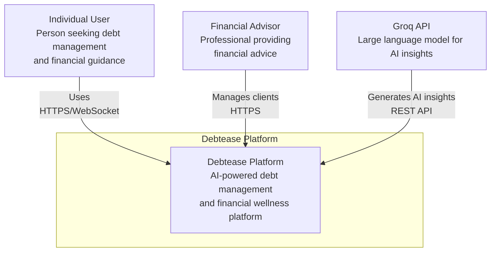
```mermaid
graph TD
    %% External Actors
    A[Individual User<br/>Person seeking debt management<br/>and financial guidance]
    B[Financial Advisor<br/>Professional providing<br/>financial advice]

    %% System Boundary
    subgraph "Debtease Platform"
        D[Debtease Platform<br/>AI-powered debt management<br/>and financial wellness platform]
    end

    %% External Systems
    C[Groq API<br/>Large language model for AI insights]


    %% Relationships
    A -->|Uses<br/>HTTPS/WebSocket| D
    B -->|Manages clients<br/>HTTPS| D

    C -->|Generates AI insights<br/>REST API| D

```

**Key External Dependencies:**
- **Groq API**: Core AI intelligence for debt analysis and recommendations

### Container Diagram (C4)

The platform follows a modern microservices-inspired architecture with clear separation of concerns.

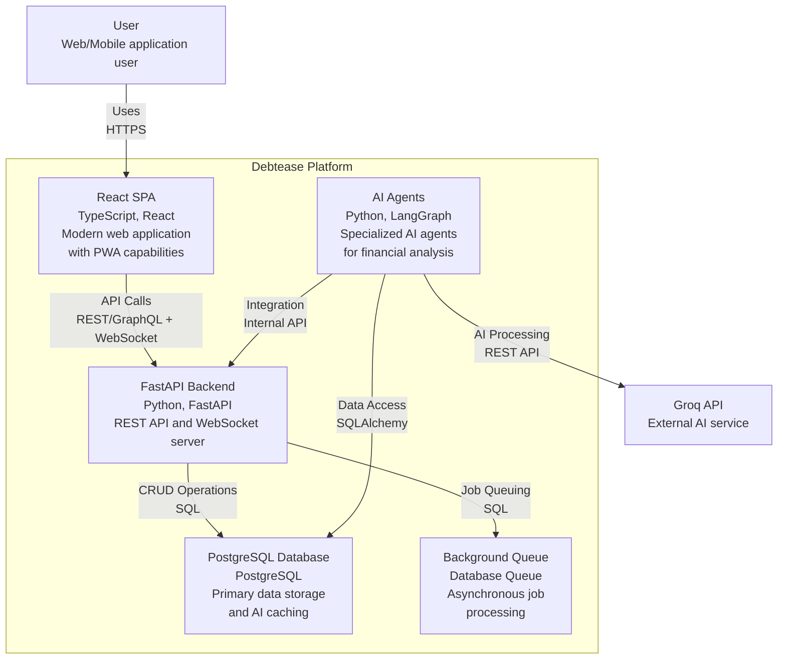
```mermaid
graph TB
    %% External Actor
    U[User<br/>Web/Mobile application user]

    %% External Systems
    GRQ[Groq API<br/>External AI service]

    %% System Boundary
    subgraph "Debtease Platform"
        FE[React SPA<br/>TypeScript, React<br/>Modern web application<br/>with PWA capabilities]
        BE[FastAPI Backend<br/>Python, FastAPI<br/>REST API and WebSocket server]
        AI[AI Agents<br/>Python, LangGraph<br/>Specialized AI agents<br/>for financial analysis]
        DB[PostgreSQL Database<br/>PostgreSQL<br/>Primary data storage<br/>and AI caching]
        QU[Background Queue<br/>Database Queue<br/>Asynchronous job<br/>processing]
    end

    %% Relationships
    U -->|Uses<br/>HTTPS| FE

    FE -->|API Calls<br/>REST/GraphQL + WebSocket| BE
    BE -->|CRUD Operations<br/>SQL| DB
    BE -->|Job Queuing<br/>SQL| QU

    AI -->|Integration<br/>Internal API| BE
    AI -->|Data Access<br/>SQLAlchemy| DB
    AI -->|AI Processing<br/>REST API| GRQ
```

### Core Workflows

#### Primary User Journey
1. **User Onboarding** → 2. **Debt Portfolio Setup** → 3. **AI Analysis** → 4. **Strategy Selection** → 5. **Ongoing Management**

#### AI Processing Pipeline
**Data Ingestion** → **Analysis** → **Strategy Generation** → **Caching** → **Delivery**

#### Key Business Processes
- **Debt Analysis**: Multi-dimensional assessment of debt portfolio health
- **Strategy Optimization**: Comparative analysis of repayment approaches
- **Scenario Simulation**: "What-if" analysis for payment changes
- **Progress Tracking**: Real-time monitoring and milestone celebrations

### Technology Stack Rationale

#### Frontend Layer
- **React + TypeScript**: Type safety, component reusability, large ecosystem
- **Tailwind CSS + shadcn/ui**: Consistent design system, accessibility, performance
- **React Query**: Efficient data fetching and caching
- **React Router**: Client-side routing with protected routes

**Rationale**: Modern, scalable frontend stack optimized for complex financial dashboards and real-time updates.

#### Backend Layer
- **FastAPI + Python**: High performance, automatic API documentation, async support
- **Pydantic**: Data validation and serialization
- **SQLAlchemy**: ORM with async support and complex query capabilities

**Rationale**: Python ecosystem excels in AI/ML integration while FastAPI provides excellent API performance.

#### AI & Machine Learning
- **Pydantic AI**: Agent framework with structured data validation and type safety
- **LangGraph**: Orchestration framework for complex multi-agent workflows
- **Groq API Models**: High-performance AI processing for financial insights
- **Enhanced Agents**: Specialized agents with prefix "enhanced_" for advanced financial analysis
- **Scikit-learn + XGBoost**: Traditional ML for pattern recognition and predictions

**Rationale**: Pydantic AI provides type-safe agent interactions, while LangGraph enables sophisticated multi-agent coordination for complex financial reasoning.

#### Data Layer
- **PostgreSQL**: ACID compliance, advanced JSON support, full-text search, and AI response caching
- **SQLAlchemy**: Async ORM with migration support

**Rationale**: PostgreSQL serves as both primary data store and caching layer, simplifying the architecture while maintaining performance.

#### Infrastructure & DevOps
- **Vercel (Frontend)**: Global CDN, automatic scaling
- **Render (Backend & Database)**: Managed hosting with auto-scaling and PostgreSQL database

**Rationale**: Render provides both backend hosting and managed database, simplifying the infrastructure while maintaining scalability.

### System Boundaries

#### In Scope (Core Platform)
- Debt portfolio management and analysis (manual data entry)
- AI-powered repayment strategy optimization
- Financial insights and recommendations via Groq API
- User onboarding and profile management
- Payment tracking and history
- AI insights caching and background processing

#### External Integrations (APIs)
- AI language models (Groq API)
- Payment processing (future integration)
- Credit reporting (future integration)

#### Out of Scope (Third-Party Services)
- Direct bank connections (manual data entry only)
- Investment management (separate wealth management features)
- Tax preparation and filing
- Insurance management
- Real estate transactions
- Email/SMS notifications (not currently implemented)

---

## 3. Project Workings

### Process Flow Diagrams

#### User Onboarding and Authentication Sequence

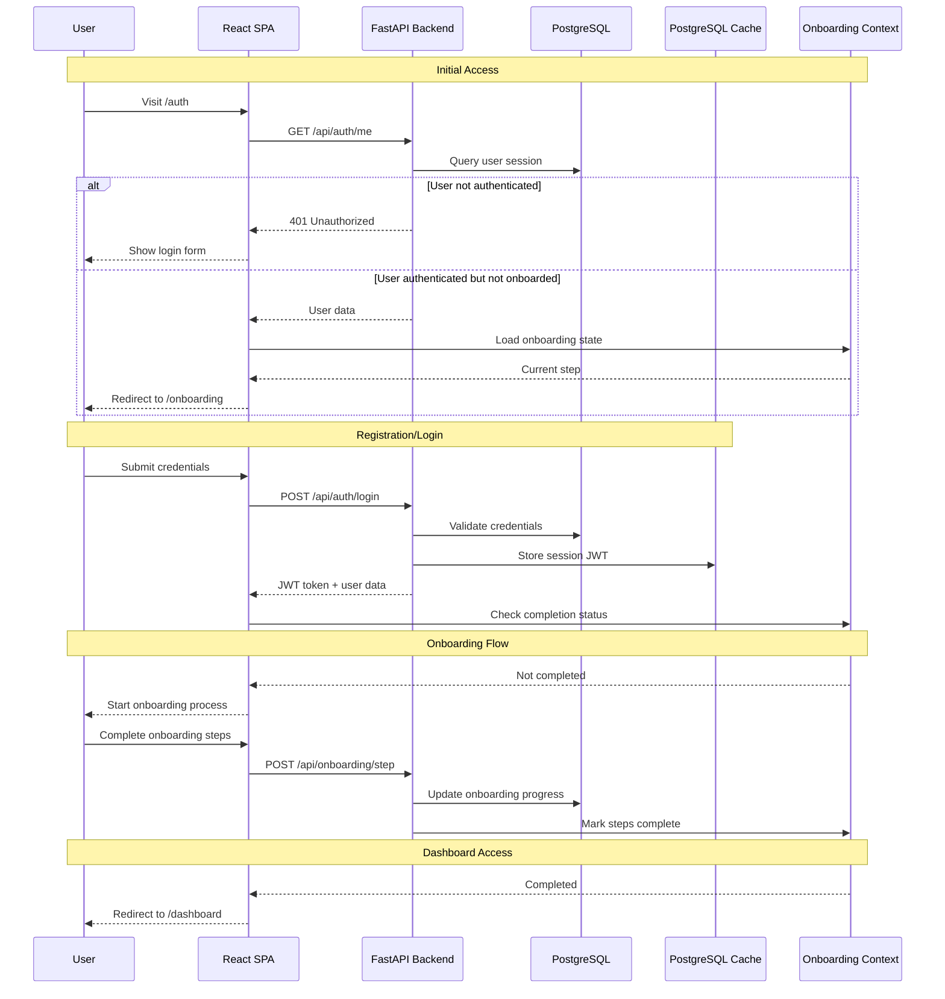
```mermaid
sequenceDiagram
    participant U as User
    participant FE as React SPA
    participant BE as FastAPI Backend
    participant DB as PostgreSQL
    participant CA as PostgreSQL Cache
    participant ON as Onboarding Context

    Note over U,ON: Initial Access
    U->>FE: Visit /auth
    FE->>BE: GET /api/auth/me
    BE->>DB: Query user session
    alt User not authenticated
        BE-->>FE: 401 Unauthorized
        FE-->>U: Show login form
    else User authenticated but not onboarded
        BE-->>FE: User data
        FE->>ON: Load onboarding state
        ON-->>FE: Current step
        FE-->>U: Redirect to /onboarding
    end

    Note over U,CA: Registration/Login
    U->>FE: Submit credentials
    FE->>BE: POST /api/auth/login
    BE->>DB: Validate credentials
    BE->>CA: Store session JWT
    BE-->>FE: JWT token + user data
    FE->>ON: Check completion status

    Note over ON,U: Onboarding Flow
    ON-->>FE: Not completed
    FE-->>U: Start onboarding process
    U->>FE: Complete onboarding steps
    FE->>BE: POST /api/onboarding/step
    BE->>DB: Update onboarding progress
    BE->>ON: Mark steps complete

    Note over ON,U: Dashboard Access
    ON-->>FE: Completed
    FE-->>U: Redirect to /dashboard
```

#### Debt Data Management Sequence

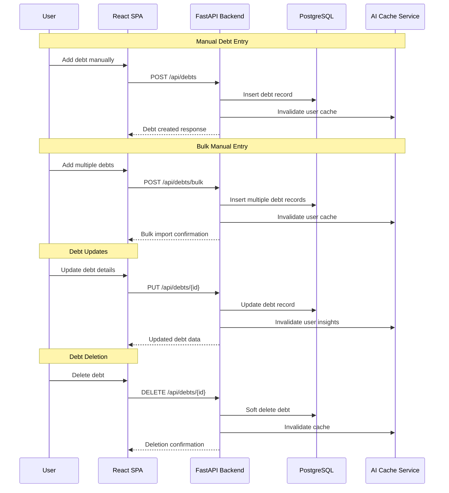
```mermaid
sequenceDiagram
    participant U as User
    participant FE as React SPA
    participant BE as FastAPI Backend
    participant DB as PostgreSQL
    participant AC as AI Cache Service

    Note over U,AC: Manual Debt Entry
    U->>FE: Add debt manually
    FE->>BE: POST /api/debts
    BE->>DB: Insert debt record
    BE->>AC: Invalidate user cache
    BE-->>FE: Debt created response

    Note over U,AC: Bulk Manual Entry
    U->>FE: Add multiple debts
    FE->>BE: POST /api/debts/bulk
    BE->>DB: Insert multiple debt records
    BE->>AC: Invalidate user cache
    BE-->>FE: Bulk import confirmation

    Note over U,FE: Debt Updates
    U->>FE: Update debt details
    FE->>BE: PUT /api/debts/{id}
    BE->>DB: Update debt record
    BE->>AC: Invalidate user insights
    BE-->>FE: Updated debt data

    Note over U,FE: Debt Deletion
    U->>FE: Delete debt
    FE->>BE: DELETE /api/debts/{id}
    BE->>DB: Soft delete debt
    BE->>AC: Invalidate cache
    BE-->>FE: Deletion confirmation
```

#### AI Insights Generation Sequence

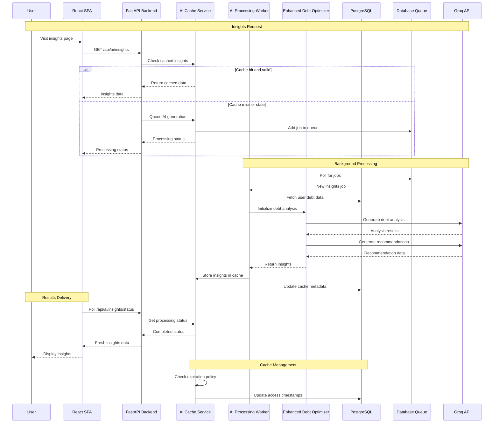
```mermaid
sequenceDiagram
    participant U as User
    participant FE as React SPA
    participant BE as FastAPI Backend
    participant AC as AI Cache Service
    participant W as AI Processing Worker
    participant A as Enhanced Debt Optimizer
    participant DB as PostgreSQL
    participant Q as Database Queue
    participant OAI as Groq API

    Note over U,OAI: Insights Request
    U->>FE: Visit insights page
    FE->>BE: GET /api/ai/insights
    BE->>AC: Check cached insights

    alt Cache hit and valid
        AC-->>BE: Return cached data
        BE-->>FE: Insights data
    else Cache miss or stale
        BE->>AC: Queue AI generation
        AC->>Q: Add job to queue
        AC-->>BE: Processing status
        BE-->>FE: Processing status
    end

    Note over W,OAI: Background Processing
    W->>Q: Poll for jobs
    Q-->>W: New insights job
    W->>DB: Fetch user debt data
    W->>A: Initialize debt analysis
    A->>OAI: Generate debt analysis
    OAI-->>A: Analysis results
    A->>OAI: Generate recommendations
    OAI-->>A: Recommendation data
    A-->>W: Return insights
    W->>AC: Store insights in cache
    W->>DB: Update cache metadata

    Note over FE,U: Results Delivery
    FE->>BE: Poll /api/ai/insights/status
    BE->>AC: Get processing status
    AC-->>BE: Completed status
    BE-->>FE: Fresh insights data
    FE-->>U: Display insights

    Note over AC,DB: Cache Management
    AC->>AC: Check expiration policy
    AC->>DB: Update access timestamps
```

### User Journey Mapping

#### Primary User Journey: From Debt to Freedom

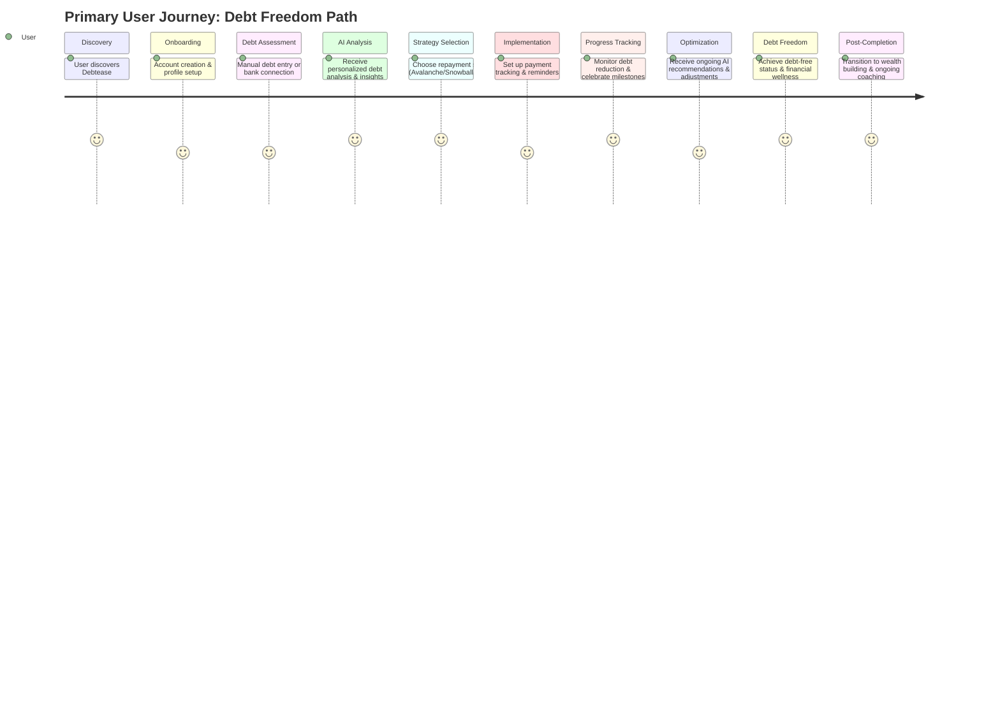
```mermaid
journey
    title Primary User Journey: Debt Freedom Path
    section Discovery
      User discovers Debtease: 5: User
    section Onboarding
      Account creation & profile setup: 4: User
    section Debt Assessment
      Manual debt entry or bank connection: 4: User
    section AI Analysis
      Receive personalized debt analysis & insights: 5: User
    section Strategy Selection
      Choose repayment strategy (Avalanche/Snowball/Custom): 5: User
    section Implementation
      Set up payment tracking & reminders: 4: User
    section Progress Tracking
      Monitor debt reduction & celebrate milestones: 5: User
    section Optimization
      Receive ongoing AI recommendations & adjustments: 4: User
    section Debt Freedom
      Achieve debt-free status & financial wellness: 5: User
    section Post-Completion
      Transition to wealth building & ongoing coaching: 5: User
```

#### Detailed Onboarding Journey

**Phase 1: Account Setup (5-10 minutes)**
1. **Welcome & Goal Setting**: User defines financial goals and timeline preferences
2. **Profile Information**: Basic demographic and financial background data
3. **Privacy & Security**: Consent management and security preferences

**Phase 2: Debt Portfolio (10-20 minutes)**
1. **Debt Discovery**: Guided questions to identify all debts
2. **Manual Entry**: Step-by-step debt information collection
3. **Bank Integration**: Optional Plaid connection for automatic data import
4. **Debt Validation**: AI-assisted verification of entered data

**Phase 3: Financial Assessment (5-10 minutes)**
1. **Income Analysis**: Current income sources and stability assessment
2. **Expense Tracking**: Spending pattern identification and categorization
3. **Risk Assessment**: Financial vulnerability and emergency fund evaluation

**Phase 4: Strategy Introduction (5 minutes)**
1. **AI Analysis**: Initial debt portfolio analysis and recommendations
2. **Strategy Options**: Explanation of different repayment approaches
3. **Personalization**: AI-customized strategy suggestions

#### Ongoing Usage Journey

**Daily/Weekly Interactions:**
- Progress dashboard reviews
- Payment reminders and confirmations
- Achievement notifications and celebrations

**Monthly Reviews:**
- AI insights updates and new recommendations
- Strategy optimization suggestions
- Financial health score updates

**Quarterly Planning:**
- Major strategy adjustments
- Goal progress assessments
- Emergency fund and savings plan reviews

### Diagram Types and Conventions

#### Flow Diagrams vs Sequence Diagrams

**Flow Diagrams** show high-level process flows, data flows between systems, or user journeys through the application. They emphasize the "what" and "where" of processes.

**Sequence Diagrams** show the chronological order of interactions between different actors, components, or systems. They emphasize the "when" and "how" of specific operations.

**When to Use Each:**
- **Flow Diagrams**: System architecture, data flow between components, user journeys, business processes
- **Sequence Diagrams**: API interactions, authentication flows, specific feature implementations, error handling

### System Data Flow Diagrams

#### High-Level Data Flow Architecture

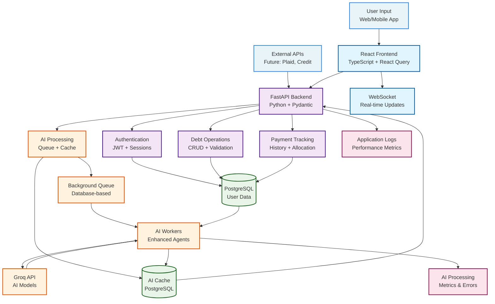
```mermaid
graph TD
    %% External Data Sources
    U[User Input<br/>Web/Mobile App] --> FE[React Frontend<br/>TypeScript + React Query]
    EXT[External APIs<br/>Future: Plaid, Credit] --> API[FastAPI Backend<br/>Python + Pydantic]

    %% Frontend Layer
    FE --> API
    FE --> WS[WebSocket<br/>Real-time Updates]

    %% Backend Processing
    API --> AUTH[Authentication<br/>JWT + Sessions]
    API --> DEBT[Debt Operations<br/>CRUD + Validation]
    API --> PAY[Payment Tracking<br/>History + Allocation]
    API --> AI[AI Processing<br/>Queue + Cache]

    %% Data Storage
    AUTH --> DB[(PostgreSQL<br/>User Data)]
    DEBT --> DB
    PAY --> DB
    AI --> CACHE[(AI Cache<br/>PostgreSQL)]

    %% AI Processing Pipeline
    AI --> QUEUE[Background Queue<br/>Database-based]
    QUEUE --> WORKER[AI Workers<br/>Enhanced Agents]
    WORKER --> OAI[Groq API<br/>AI Models]
    WORKER --> CACHE

    %% Data Relationships
    DB --> WORKER
    CACHE --> API
    OAI --> WORKER

    %% Monitoring & Analytics
    API --> LOGS[Application Logs<br/>Performance Metrics]
    WORKER --> METRICS[AI Processing<br/>Metrics & Errors]

    %% Styling
    classDef external fill:#e8f4f8,stroke:#2e86de,stroke-width:2px
    classDef frontend fill:#e1f5fe,stroke:#01579b,stroke-width:2px
    classDef backend fill:#f3e5f5,stroke:#4a148c,stroke-width:2px
    classDef data fill:#e8f5e8,stroke:#1b5e20,stroke-width:2px
    classDef ai fill:#fff3e0,stroke:#e65100,stroke-width:2px
    classDef monitoring fill:#fce4ec,stroke:#880e4f,stroke-width:2px

    class U,EXT external
    class FE,WS frontend
    class API,AUTH,DEBT,PAY backend
    class DB,CACHE data
    class AI,QUEUE,WORKER,OAI ai
    class LOGS,METRICS monitoring
```

**Data Flow Legend:**
- **Blue (External)**: Data entering the system from users or external services
- **Light Blue (Frontend)**: Client-side processing and user interface
- **Purple (Backend)**: Server-side business logic and API processing
- **Green (Data)**: Persistent data storage and caching layers
- **Orange (AI)**: AI processing pipeline and external AI services
- **Pink (Monitoring)**: Observability and performance tracking

### AI Processing Pipeline

#### Multi-Agent AI Architecture

Debtease employs a sophisticated multi-agent system built with **Pydantic AI** and orchestrated through **LangGraph**, enabling complex financial reasoning and coordinated decision-making. The **enhanced agents** provide structured, type-safe financial analysis with professional-grade consultation workflows.

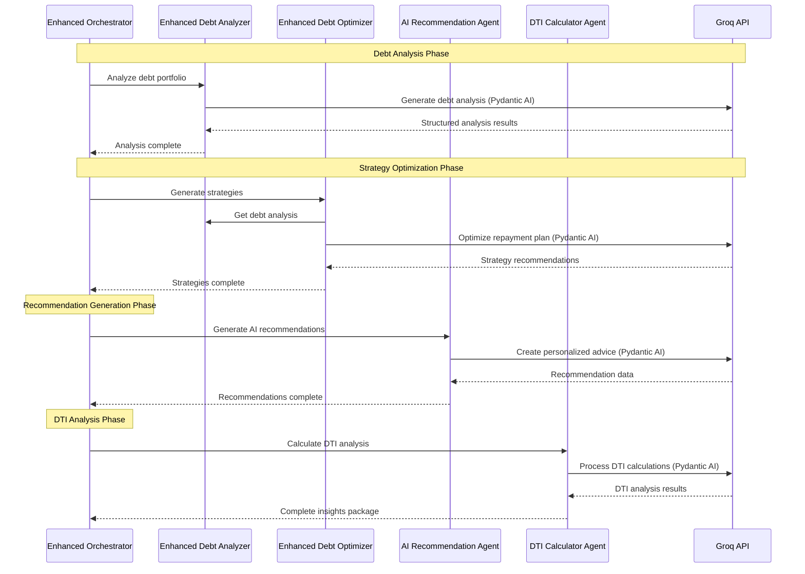
```mermaid
sequenceDiagram
    participant EO as Enhanced Orchestrator
    participant EDA as Enhanced Debt Analyzer
    participant EDO as Enhanced Debt Optimizer
    participant ARA as AI Recommendation Agent
    participant DTC as DTI Calculator Agent
    participant GRQ as Groq API

    Note over EO,GRQ: Debt Analysis Phase
    EO->>EDA: Analyze debt portfolio
    EDA->>GRQ: Generate debt analysis (Pydantic AI)
    GRQ-->>EDA: Structured analysis results
    EDA-->>EO: Analysis complete

    Note over EO,GRQ: Strategy Optimization Phase
    EO->>EDO: Generate strategies
    EDO->>EDA: Get debt analysis
    EDO->>GRQ: Optimize repayment plan (Pydantic AI)
    GRQ-->>EDO: Strategy recommendations
    EDO-->>EO: Strategies complete

    Note over EO,EO: Recommendation Generation Phase
    EO->>ARA: Generate AI recommendations
    ARA->>GRQ: Create personalized advice (Pydantic AI)
    GRQ-->>ARA: Recommendation data
    ARA-->>EO: Recommendations complete

    Note over EO,EO: DTI Analysis Phase
    EO->>DTC: Calculate DTI analysis
    DTC->>GRQ: Process DTI calculations (Pydantic AI)
    GRQ-->>DTC: DTI analysis results
    DTC-->>EO: Complete insights package
```

#### AI Processing Stages

**Stage 1: Data Preparation (Preprocessing)**
- Debt portfolio normalization and validation
- Historical payment pattern analysis
- Financial health metric calculation
- Risk factor assessment

**Stage 2: Multi-Dimensional Analysis**
- Interest rate optimization analysis
- Psychological debt repayment factors
- Cash flow and budget constraint evaluation
- Long-term financial goal alignment

**Stage 3: Strategy Generation**
- Avalanche vs. Snowball strategy comparison
- Custom hybrid strategy development
- Scenario-based "what-if" analysis
- Risk-adjusted recommendation weighting

**Stage 4: Recommendation Personalization**
- User behavior pattern incorporation
- Contextual factor consideration (life events, market conditions)
- Communication style adaptation
- Actionable next-step prioritization

#### Intelligent Caching Strategy

**Cache Architecture:**
- **Database Caching**: PostgreSQL-based caching for AI responses and computations
- **Smart Invalidation**: Event-driven cache updates on debt/portfolio changes
- **TTL Management**: Time-based expiration with usage-based extension
- **Compression**: Efficient storage of complex AI-generated content

**Cache Invalidation Rules:**
- **Debt Changes**: Immediate invalidation of user-specific insights
- **Payment Updates**: Partial cache updates for progress metrics
- **Time-Based**: Automatic refresh for time-sensitive recommendations
- **Usage-Based**: Popular insights retained longer in cache

**Performance Optimization:**
- **Background Processing**: Async AI generation with queue management
- **Progressive Loading**: Cached data served immediately, fresh data streamed
- **Cost Management**: Intelligent cache utilization reduces API calls
- **Scalability**: Distributed cache supporting horizontal scaling

---

## 4. Data Models

### Entity Relationship Diagram (ERD)

Debtease's data model centers around Users managing their Debt portfolios through Payments, with AI-driven insights cached for performance. The system supports complex financial relationships while maintaining data integrity and audit trails.

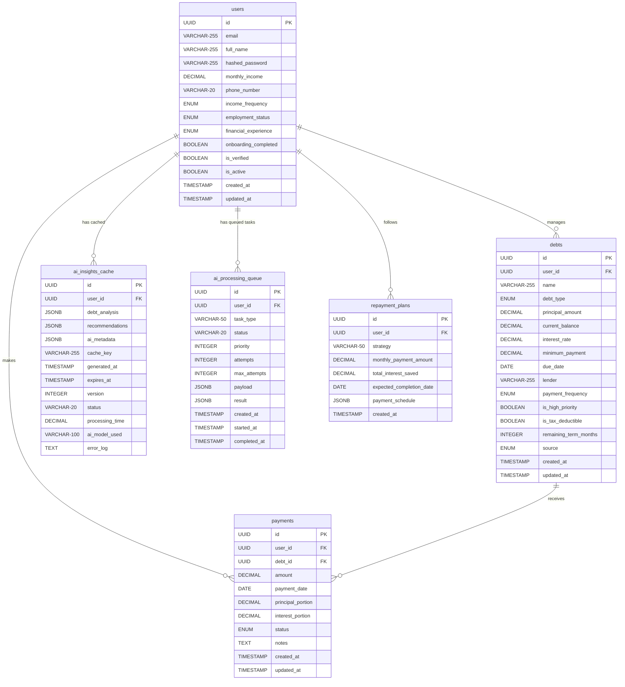
```mermaid
erDiagram
    users {
        UUID id PK
        VARCHAR-255 email
        VARCHAR-255 full_name
        VARCHAR-255 hashed_password
        DECIMAL monthly_income
        VARCHAR-20 phone_number
        ENUM income_frequency
        ENUM employment_status
        ENUM financial_experience
        BOOLEAN onboarding_completed
        BOOLEAN is_verified
        BOOLEAN is_active
        TIMESTAMP created_at
        TIMESTAMP updated_at
    }

    debts {
        UUID id PK
        UUID user_id FK
        VARCHAR-255 name
        ENUM debt_type
        DECIMAL principal_amount
        DECIMAL current_balance
        DECIMAL interest_rate
        DECIMAL minimum_payment
        DATE due_date
        VARCHAR-255 lender
        ENUM payment_frequency
        BOOLEAN is_high_priority
        BOOLEAN is_tax_deductible
        INTEGER remaining_term_months
        ENUM source
        TIMESTAMP created_at
        TIMESTAMP updated_at
    }

    payments {
        UUID id PK
        UUID user_id FK
        UUID debt_id FK
        DECIMAL amount
        DATE payment_date
        DECIMAL principal_portion
        DECIMAL interest_portion
        ENUM status
        TEXT notes
        TIMESTAMP created_at
        TIMESTAMP updated_at
    }

    ai_insights_cache {
        UUID id PK
        UUID user_id FK
        JSONB debt_analysis
        JSONB recommendations
        JSONB ai_metadata
        VARCHAR-255 cache_key
        TIMESTAMP generated_at
        TIMESTAMP expires_at
        INTEGER version
        VARCHAR-20 status
        DECIMAL processing_time
        VARCHAR-100 ai_model_used
        TEXT error_log
    }

    ai_processing_queue {
        UUID id PK
        UUID user_id FK
        VARCHAR-50 task_type
        VARCHAR-20 status
        INTEGER priority
        INTEGER attempts
        INTEGER max_attempts
        JSONB payload
        JSONB result
        TIMESTAMP created_at
        TIMESTAMP started_at
        TIMESTAMP completed_at
    }

    repayment_plans {
        UUID id PK
        UUID user_id FK
        VARCHAR-50 strategy
        DECIMAL monthly_payment_amount
        DECIMAL total_interest_saved
        DATE expected_completion_date
        JSONB payment_schedule
        TIMESTAMP created_at
    }

    users ||--o{ debts : manages
    users ||--o{ payments : makes
    users ||--o{ ai_insights_cache : "has cached"
    users ||--o{ ai_processing_queue : "has queued tasks"
    users ||--o{ repayment_plans : follows
    debts ||--o{ payments : receives
```

### Core Business Objects

#### User Entity
**Purpose**: Central identity and profile management for platform users
**Key Attributes**:
- **Authentication**: Email, hashed password, verification status
- **Financial Profile**: Monthly income, employment status, financial experience level
- **Onboarding State**: Completion tracking and progress management
- **Preferences**: Notification settings, income frequency
- **Integrations**: Plaid access tokens for bank connectivity

#### Debt Entity
**Purpose**: Comprehensive debt portfolio tracking with financial details
**Key Attributes**:
- **Source**: Currently always 'manual' (manual data entry only, no bank integrations yet)
- **Financial Details**: Principal, balance, interest rate, minimum payments
- **Classification**: Debt type, priority level, tax deductibility
- **Scheduling**: Due dates, payment frequency, remaining term
- **Metadata**: Lender information, notes

#### Payment Entity
**Purpose**: Detailed payment tracking with principal/interest breakdown
**Key Attributes**:
- **Transaction Data**: Amount, date, status, notes
- **Allocation**: Principal vs. interest portion breakdown
- **Audit Trail**: Creation and update timestamps
- **Relationships**: Links to specific debts and users

#### AI Insights Cache Entity
**Purpose**: Performance optimization through intelligent caching of expensive AI computations
**Key Attributes**:
- **Cached Content**: Debt analysis, recommendations, metadata
- **Cache Management**: Key generation, expiration, version control
- **Performance Metrics**: Processing time, model used, error logging
- **Invalidation Logic**: Hash-based cache key for automatic updates

#### AI Processing Queue Entity
**Purpose**: Background job management for asynchronous AI processing tasks
**Key Attributes**:
- **Job Management**: Task type, status, priority, retry logic (attempts/max_attempts)
- **Data Payload**: JSONB storage for flexible job parameters and results
- **Implementation**: PostgreSQL-based queue system for reliable background processing
- **Audit Trail**: Creation, start, and completion timestamps for monitoring

### Data Flow Between Components

#### User Registration → Onboarding → Dashboard Access

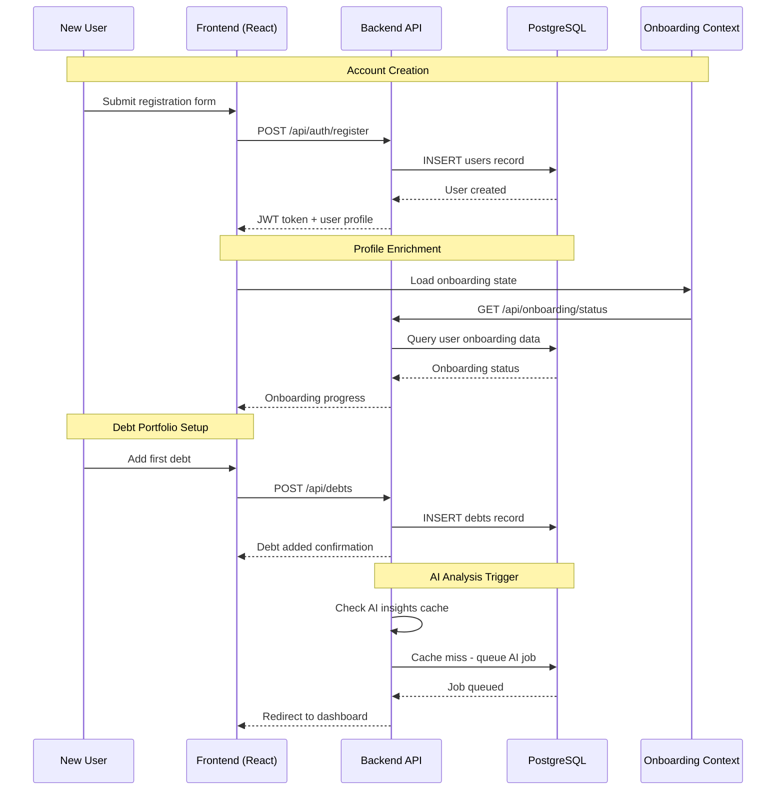
```mermaid
sequenceDiagram
    participant U as New User
    participant FE as Frontend (React)
    participant API as Backend API
    participant DB as PostgreSQL
    participant C as Onboarding Context

    Note over U,C: Account Creation
    U->>FE: Submit registration form
    FE->>API: POST /api/auth/register
    API->>DB: INSERT users record
    DB-->>API: User created
    API-->>FE: JWT token + user profile

    Note over FE,DB: Profile Enrichment
    FE->>C: Load onboarding state
    C->>API: GET /api/onboarding/status
    API->>DB: Query user onboarding data
    DB-->>API: Onboarding status
    API-->>FE: Onboarding progress

    Note over U,FE: Debt Portfolio Setup
    U->>FE: Add first debt
    FE->>API: POST /api/debts
    API->>DB: INSERT debts record
    API-->>FE: Debt added confirmation

    Note over API,DB: AI Analysis Trigger
    API->>API: Check AI insights cache
    API->>DB: Cache miss - queue AI job
    DB-->>API: Job queued
    API-->>FE: Redirect to dashboard
```

#### Payment Processing → Debt Updates → AI Insights Refresh

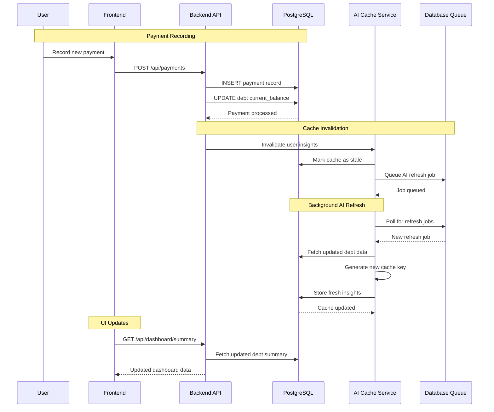
```mermaid
sequenceDiagram
    participant U as User
    participant FE as Frontend
    participant API as Backend API
    participant DB as PostgreSQL
    participant AC as AI Cache Service
    participant Q as Database Queue

    Note over U,DB: Payment Recording
    U->>FE: Record new payment
    FE->>API: POST /api/payments
    API->>DB: INSERT payment record
    API->>DB: UPDATE debt current_balance
    DB-->>API: Payment processed

    Note over API,Q: Cache Invalidation
    API->>AC: Invalidate user insights
    AC->>DB: Mark cache as stale
    AC->>Q: Queue AI refresh job
    Q-->>AC: Job queued

    Note over AC,DB: Background AI Refresh
    AC->>Q: Poll for refresh jobs
    Q-->>AC: New refresh job
    AC->>DB: Fetch updated debt data
    AC->>AC: Generate new cache key
    AC->>DB: Store fresh insights
    DB-->>AC: Cache updated

    Note over FE,FE: UI Updates
    FE->>API: GET /api/dashboard/summary
    API->>DB: Fetch updated debt summary
    API-->>FE: Updated dashboard data
```

### Caching Data Structures

#### PostgreSQL-Based Cache Architecture

**Primary Cache Layer: PostgreSQL**
- **Purpose**: Single unified caching layer for all cached data
- **TTL**: 7 days for AI insights, configurable for other data types
- **Content**: AI-generated insights, user preferences, computational results
- **Invalidation**: Hash-based (debt portfolio changes) + time-based expiration

#### Cache Key Generation Strategy

```python
def generate_cache_key(user_id: UUID, debt_portfolio: List[Dict]) -> str:
    """
    Creates deterministic hash from user's debt portfolio.
    Any change to debt data invalidates the cache automatically.
    """
    # Sort debts for consistent ordering
    sorted_debts = sorted(debt_portfolio, key=lambda d: d['id'])

    # Extract relevant fields for cache key
    signature = {
        'user_id': str(user_id),
        'debts': [{
            'id': str(debt['id']),
            'balance': debt['current_balance'],
            'interest_rate': debt['interest_rate'],
            'minimum_payment': debt['minimum_payment']
        } for debt in sorted_debts]
    }

    # Generate SHA256 hash
    return hashlib.sha256(
        json.dumps(signature, sort_keys=True).encode()
    ).hexdigest()
```

#### Cache Performance Metrics

- **Hit Rate Target**: >80% for AI insights (PostgreSQL-based)
- **Average Response Time**: <200ms for cached AI responses
- **Cache Size Management**: Automatic cleanup of expired entries via database triggers
- **Storage Efficiency**: JSONB columns for flexible AI response storage

---

## 5. Key Implementation Details

### AI Agent Architecture

Debtease implements a sophisticated multi-agent AI system using **Pydantic AI** for structured agent interactions and **LangGraph** for orchestration, enabling complex financial reasoning and coordinated decision-making across specialized agents.

#### Enhanced Agent Components

The system features **enhanced agents** (prefixed with "enhanced_") built with Pydantic AI that provide structured, type-safe financial analysis:

**1. Enhanced Debt Analyzer (`enhanced_debt_analyzer.py`)**
- **Framework**: Pydantic AI with Groq models
- **Purpose**: Comprehensive debt portfolio analysis with structured outputs
- **Key Features**:
  - Multi-dimensional debt assessment
  - Interest rate optimization analysis
  - Risk evaluation and prioritization
  - Type-safe result validation

**2. Enhanced Debt Optimizer (`enhanced_debt_optimizer.py`)**
- **Framework**: Pydantic AI with structured strategy generation
- **Purpose**: Mathematical optimization with AI-enhanced reasoning
- **Key Features**:
  - Avalanche vs. Snowball strategy comparison
  - Custom hybrid strategy development
  - Risk-adjusted recommendations
  - Timeline projections and savings calculations

**3. Enhanced Orchestrator (`enhanced_orchestrator.py`)**
- **Framework**: Pydantic AI coordination layer
- **Purpose**: Professional AI consultation workflow management
- **Key Features**:
  - Multi-agent coordination with structured data flow
  - Type-safe result aggregation and validation
  - Repository layer integration for data persistence
  - Performance monitoring and comprehensive error handling

**Additional Enhanced Agents:**
- **AI Recommendation Agent**: Generates personalized financial advice
- **DTI Calculator Agent**: Calculates debt-to-income ratios and analysis
- **Test Enhanced Agents**: Comprehensive testing suite for agent validation

#### Pydantic AI Framework Implementation

The enhanced agents leverage **Pydantic AI** for:

**Structured Data Validation:**
```python
class DebtAnalysisResult(BaseModel):
    """Type-safe debt analysis results."""
    total_debt: float
    debt_count: int
    average_interest_rate: float
    # ... with full type validation
```

**Agent Configuration:**
```python
# Groq model integration with Pydantic AI
agent = Agent(
    model=GroqModel(settings.GROQ_MODEL),
    result_type=DebtAnalysisResult,
    deps_type=AnalysisDependencies
)
```

**Type-Safe Agent Interactions:**
- Structured input/output validation
- Automatic error handling and retries
- Dependency injection for data access
- Result type enforcement for API compatibility

#### LangGraph Orchestration Framework

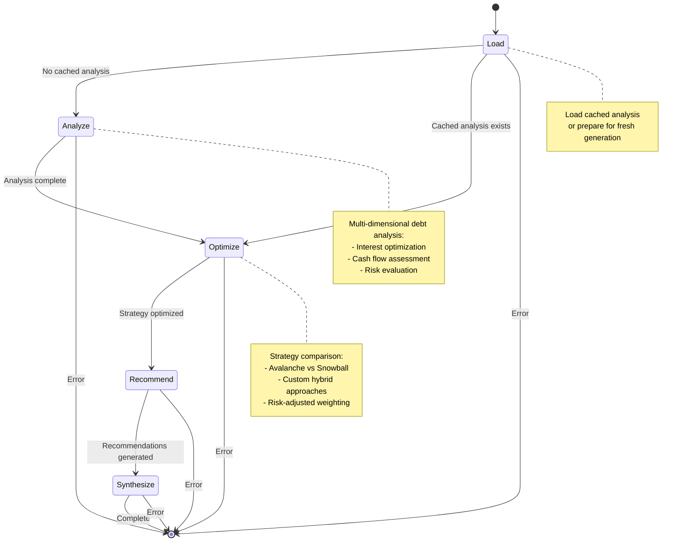
```mermaid
stateDiagram-v2
    [*] --> Load
    Load --> Analyze : No cached analysis
    Load --> Optimize : Cached analysis exists

    Analyze --> Optimize : Analysis complete
    Optimize --> Recommend : Strategy optimized
    Recommend --> Synthesize : Recommendations generated
    Synthesize --> [*] : Complete

    Load --> [*] : Error
    Analyze --> [*] : Error
    Optimize --> [*] : Error
    Recommend --> [*] : Error
    Synthesize --> [*] : Error

    note right of Load
        Load cached analysis<br/>or prepare for fresh generation
    end note

    note right of Analyze
        Multi-dimensional debt analysis:<br/>- Interest optimization<br/>- Cash flow assessment<br/>- Risk evaluation
    end note

    note right of Optimize
        Strategy comparison:<br/>- Avalanche vs Snowball<br/>- Custom hybrid approaches<br/>- Risk-adjusted weighting
    end note
```

#### Specialized AI Agent Components

**1. Debt Analyzer Agent (`DebtAnalyzingAgent`)**
```python
class DebtAnalyzingAgent:
    """
    Specialized agent for comprehensive debt portfolio analysis.
    Uses pattern recognition and financial modeling.
    """

    def analyze(self, debts: List[Debt]) -> DebtAnalysis:
        """
        Perform multi-dimensional debt analysis:
        1. Portfolio composition and risk assessment
        2. Interest rate optimization opportunities
        3. Payment behavior patterns
        4. Debt consolidation potential
        5. Long-term financial impact projections
        """
        # Implementation uses Groq API for complex reasoning
        # Structured prompts for consistent analysis output
        # Validation of financial calculations
        pass
```

**2. Strategy Optimizer Agent (`DebtOptimizerAgent`)**
```python
class DebtOptimizerAgent:
    """
    Mathematical optimization agent for repayment strategies.
    Employs algorithms for strategy comparison and customization.
    """

    def optimize(self, debts: List[Debt], analysis: DebtAnalysis) -> RepaymentPlanSummary:
        """
        Generate optimized repayment strategies:
        1. Mathematical comparison of Avalanche vs Snowball
        2. Custom hybrid strategy development
        3. Scenario-based "what-if" analysis
        4. Risk-adjusted recommendation weighting
        5. Long-term savings calculations
        """
        # Implementation uses financial mathematics
        # Monte Carlo simulations for uncertainty
        # Goal-oriented optimization algorithms
        pass
```

### Detailed Sequence Diagrams

#### AI Insights Generation Sequence

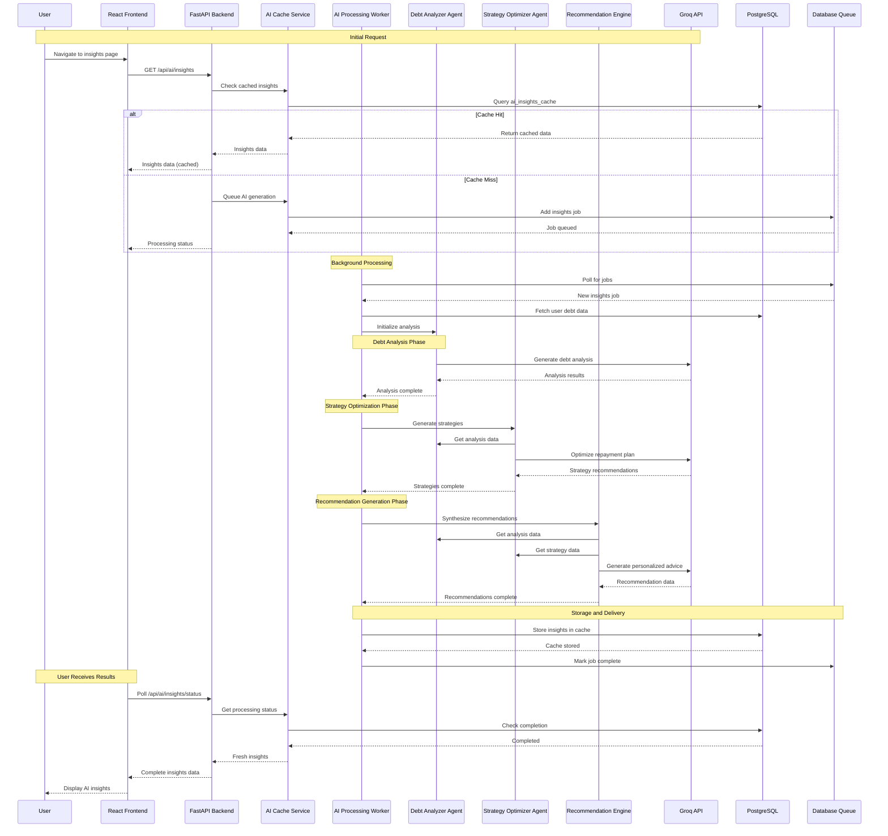
```mermaid
sequenceDiagram
    participant U as User
    participant FE as React Frontend
    participant API as FastAPI Backend
    participant CS as AI Cache Service
    participant W as AI Processing Worker
    participant A as Debt Analyzer Agent
    participant SO as Strategy Optimizer Agent
    participant RE as Recommendation Engine
    participant OAI as Groq API
    participant DB as PostgreSQL
    participant Q as Database Queue

    Note over U,OAI: Initial Request
    U->>FE: Navigate to insights page
    FE->>API: GET /api/ai/insights
    API->>CS: Check cached insights
    CS->>DB: Query ai_insights_cache

    alt Cache Hit
        DB-->>CS: Return cached data
        CS-->>API: Insights data
        API-->>FE: Insights data (cached)
    else Cache Miss
        API->>CS: Queue AI generation
        CS->>Q: Add insights job
        Q-->>CS: Job queued
        API-->>FE: Processing status
    end

    Note over W,W: Background Processing
    W->>Q: Poll for jobs
    Q-->>W: New insights job
    W->>DB: Fetch user debt data
    W->>A: Initialize analysis

    Note over A,W: Debt Analysis Phase
    A->>OAI: Generate debt analysis
    OAI-->>A: Analysis results
    A-->>W: Analysis complete

    Note over W,W: Strategy Optimization Phase
    W->>SO: Generate strategies
    SO->>A: Get analysis data
    SO->>OAI: Optimize repayment plan
    OAI-->>SO: Strategy recommendations
    SO-->>W: Strategies complete

    Note over W,W: Recommendation Generation Phase
    W->>RE: Synthesize recommendations
    RE->>A: Get analysis data
    RE->>SO: Get strategy data
    RE->>OAI: Generate personalized advice
    OAI-->>RE: Recommendation data
    RE-->>W: Recommendations complete

    Note over W,Q: Storage and Delivery
    W->>DB: Store insights in cache
    DB-->>W: Cache stored
    W->>Q: Mark job complete

    Note over FE,U: User Receives Results
    FE->>API: Poll /api/ai/insights/status
    API->>CS: Get processing status
    CS->>DB: Check completion
    DB-->>CS: Completed
    CS-->>API: Fresh insights
    API-->>FE: Complete insights data
    FE-->>U: Display AI insights
```

#### Authentication and Authorization Flow

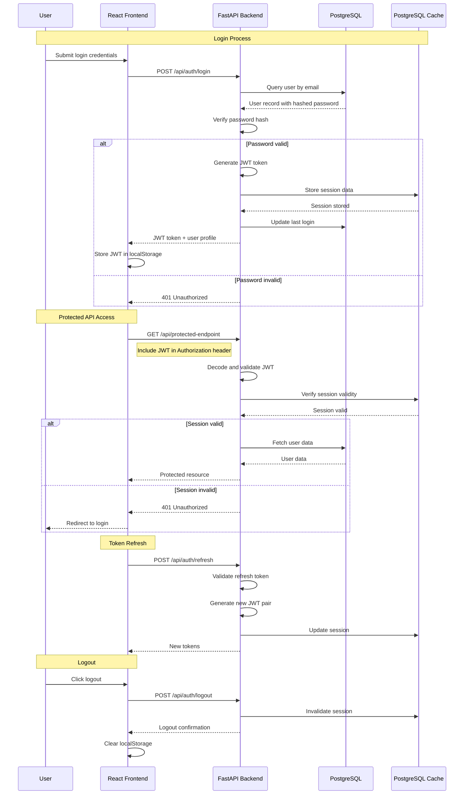
```mermaid
sequenceDiagram
    participant U as User
    participant FE as React Frontend
    participant API as FastAPI Backend
    participant DB as PostgreSQL
    participant R as PostgreSQL Cache

    Note over U,R: Login Process
    U->>FE: Submit login credentials
    FE->>API: POST /api/auth/login
    API->>DB: Query user by email
    DB-->>API: User record with hashed password

    API->>API: Verify password hash
    alt Password valid
        API->>API: Generate JWT token
        API->>R: Store session data
        R-->>API: Session stored
        API->>DB: Update last login
        API-->>FE: JWT token + user profile
        FE->>FE: Store JWT in localStorage
    else Password invalid
        API-->>FE: 401 Unauthorized
    end

    Note over FE,U: Protected API Access
    FE->>API: GET /api/protected-endpoint
    Note right of FE: Include JWT in Authorization header
    API->>API: Decode and validate JWT
    API->>R: Verify session validity
    R-->>API: Session valid

    alt Session valid
        API->>DB: Fetch user data
        DB-->>API: User data
        API-->>FE: Protected resource
    else Session invalid
        API-->>FE: 401 Unauthorized
        FE-->>U: Redirect to login
    end

    Note over FE,FE: Token Refresh
    FE->>API: POST /api/auth/refresh
    API->>API: Validate refresh token
    API->>API: Generate new JWT pair
    API->>R: Update session
    API-->>FE: New tokens

    Note over U,FE: Logout
    U->>FE: Click logout
    FE->>API: POST /api/auth/logout
    API->>R: Invalidate session
    API-->>FE: Logout confirmation
    FE->>FE: Clear localStorage
```

---

## 6. Appendices

### Glossary

#### Technical Terms
- **AI Agent**: Specialized software component that performs specific financial analysis tasks using AI/ML models
- **Avalanche Strategy**: Debt repayment method prioritizing highest interest rate debts first
- **Cache Key**: Unique identifier used to store and retrieve cached data
- **Debt-to-Income (DTI) Ratio**: Percentage of monthly income used for debt payments
- **JWT (JSON Web Token)**: Secure token format for authentication and authorization
- **LangGraph**: Framework for building complex AI workflows with state management
- **Snowball Strategy**: Debt repayment method prioritizing smallest balance debts first
- **TTL (Time To Live)**: Duration for which cached data remains valid

#### Business Terms
- **Debt Portfolio**: Complete collection of an individual's debts and financial obligations
- **Interest Optimization**: Strategy to minimize total interest paid over debt repayment period
- **Payment Allocation**: Division of payments between principal and interest portions
- **Repayment Horizon**: Estimated time required to become debt-free
- **Strategy Comparison**: Side-by-side analysis of different repayment approaches

### API Reference Summary

#### Core API Endpoints

**Authentication (`/api/auth`)**
- `POST /register` - User registration
- `POST /auth/login/form` - User authentication (form-encoded)
- `GET /me` - Current user profile
- `GET /verify-session` - Verify session validity
- `POST /extend-session` - Extend session duration
- `POST /logout` - User logout

**Debt Management (`/api/debts`)**
- `GET /` - List user debts (with `active_only` filter)
- `POST /` - Create new debt
- `GET /{id}` - Get specific debt details
- `PUT /{id}` - Update debt
- `GET /summary` - Get debt portfolio summary
- `GET /high-priority` - Get high priority debts
- `POST /{id}/payment` - Record payment for specific debt
- `GET /reminders` - Get payment reminders

**Payment Management (`/api/payments`)**
- `GET /history` - List payment history (with optional `debt_id` filter)

**AI Insights (`/api/ai`)**
- `GET /insights` - Get cached AI-generated insights
- `GET /insights/enhanced` - Get enhanced AI insights
- `GET /insights/status` - Get AI insights processing status
- `POST /insights/refresh` - Force refresh AI insights
- `DELETE /insights/cache` - Invalidate AI insights cache
- `GET /recommendations` - Get AI-generated recommendations
- `GET /strategies/compare` - Compare repayment strategies
- `GET /dti` - Get Debt-to-Income analysis
- `POST /simulate` - Run payment scenario simulations
- `GET /timeline` - Generate payment timeline
- `POST /optimize` - Calculate optimization metrics
- `GET /queue/status` - Get AI processing queue status

**Onboarding (`/api/onboarding`)**
- `POST /start` - Start onboarding process
- `GET /status` - Get onboarding progress
- `POST /profile` - Update user profile during onboarding
- `POST /goals` - Set user financial goals
- `POST /complete` - Complete onboarding process

#### Response Status Codes
- `200` - Success
- `201` - Created
- `400` - Bad Request (validation error)
- `401` - Unauthorized
- `403` - Forbidden
- `404` - Not Found
- `422` - Unprocessable Entity
- `500` - Internal Server Error
- `503` - Service Unavailable (AI processing)

### Deployment Architecture

#### Production Infrastructure

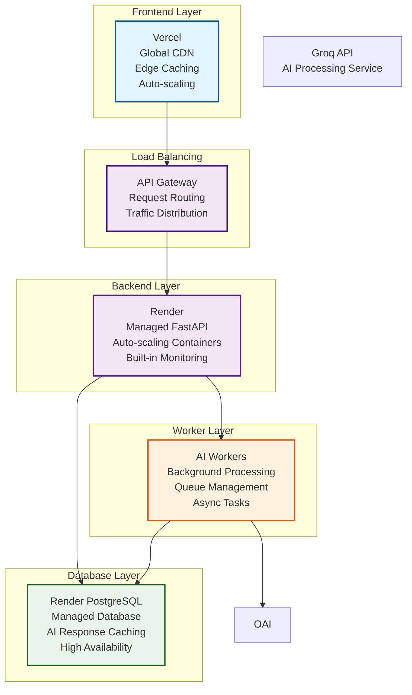
```mermaid
graph TB
    %% External Services
    GRQ[Groq API<br/>AI Processing Service]

    %% Production Infrastructure
    subgraph "Frontend Layer"
        V[Vercel<br/>Global CDN<br/>Edge Caching<br/>Auto-scaling]
    end

    subgraph "Load Balancing"
        LB[API Gateway<br/>Request Routing<br/>Traffic Distribution]
    end

    subgraph "Backend Layer"
        R[Render<br/>Managed FastAPI<br/>Auto-scaling Containers<br/>Built-in Monitoring]
    end

    subgraph "Database Layer"
        S[Render PostgreSQL<br/>Managed Database<br/>AI Response Caching<br/>High Availability]
    end

    subgraph "Worker Layer"
        W[AI Workers<br/>Background Processing<br/>Queue Management<br/>Async Tasks]
    end

    %% Data Flow
    V --> LB
    LB --> R
    R --> S
    R --> W
    W --> S
    W --> OAI

    %% Notes
    classDef frontend fill:#e1f5fe,stroke:#01579b,stroke-width:2px
    classDef backend fill:#f3e5f5,stroke:#4a148c,stroke-width:2px
    classDef database fill:#e8f5e8,stroke:#1b5e20,stroke-width:2px
    classDef worker fill:#fff3e0,stroke:#e65100,stroke-width:2px

    class V frontend
    class R,LB backend
    class S database
    class W worker
```

#### Environment Configuration

**Development Environment:**
- Local PostgreSQL database
- PostgreSQL for AI response caching
- Direct Groq API access
- File-based logging

**Staging Environment:**
- Render PostgreSQL (smaller instance)
- PostgreSQL-based caching and queues
- Groq API with rate limits
- Structured logging to external service

**Production Environment:**
- Render PostgreSQL (production tier)
- PostgreSQL-based caching and queues
- Groq API with enterprise limits
- Comprehensive monitoring and alerting

#### Scaling Strategy

**Horizontal Scaling:**
- **Frontend**: Vercel's global CDN handles traffic spikes
- **Backend**: Render auto-scaling based on CPU/memory usage
- **AI Workers**: Configurable worker pool size
- **Database**: Render PostgreSQL connection pooling

**Performance Optimization:**
- **Caching**: PostgreSQL-based caching reduces API calls
- **CDN**: Static assets served globally
- **Compression**: API responses compressed
- **Background Processing**: Expensive operations moved off critical path

### Performance Considerations

#### Key Metrics and Targets

**Response Times:**
- API endpoints: <500ms P95
- AI insights (cached): <100ms
- AI insights (fresh): <30 seconds
- Page load: <2 seconds

**Throughput:**
- API requests: 1000 RPS sustained
- AI processing: 50 concurrent jobs
- Database connections: 100 max

**Resource Utilization:**
- CPU usage: <70% average
- Memory usage: <80% average
- Database connections: <80% of limit
- Cache hit rate: >85%

#### Monitoring and Alerting

**Application Metrics:**
- Request latency and error rates
- AI processing queue depth
- Cache hit/miss ratios
- Database query performance

**Business Metrics:**
- User onboarding completion rate
- AI insights generation success rate
- Debt portfolio growth
- User engagement and retention

**Infrastructure Metrics:**
- Server resource utilization
- Database performance
- External API availability
- Background job processing

#### Bottleneck Mitigation

**AI Processing Bottlenecks:**
- Background queue processing
- Intelligent caching strategies
- Rate limiting for external APIs
- Fallback mechanisms for AI failures

**Database Bottlenecks:**
- Connection pooling and prepared statements
- Query optimization and strategic indexing
- JSONB indexing for AI cache queries
- Efficient caching directly in PostgreSQL

**Frontend Bottlenecks:**
- CDN for static assets
- Code splitting and lazy loading
- Service worker caching
- Progressive loading of heavy components

---

**Document Version:** 0.3
**Last Updated:** December 2025
**Authors:** Debtease Development Team
**Review Status:** Updated with Pydantic AI Agent Details
