# Debtease Technical Documentation

## Table of Contents

1. [Executive Summary](#1-executive-summary)
2. [High-Level Overview](#2-high-level-overview)
3. [Project Workings](#3-project-workings)
4. [Data Models](#4-data-models)
5. [Key Implementation Details](#5-key-implementation-details)
6. [Appendices](#6-appendices)

---

## 1. Executive Summary

### Project Overview

**Debtease** is a comprehensive, AI-powered debt management and financial wellness platform designed to transform how individuals approach debt repayment and financial planning. Built with cutting-edge technology and a user-centric philosophy, Debtease combines intelligent debt analysis, personalized repayment strategies, and holistic financial coaching to empower users on their journey to financial freedom.

### The Problem

Traditional debt management tools are often limited to basic calculators and manual tracking, leaving users overwhelmed by complex financial decisions and lacking personalized guidance. Many individuals struggle with:
- Choosing optimal repayment strategies (Avalanche vs. Snowball)
- Understanding the long-term impact of payment decisions
- Maintaining motivation through extended repayment periods
- Balancing debt reduction with emergency savings and investments
- Making sense of competing financial priorities and goals

### Solution & Value Proposition

Debtease addresses these challenges through an intelligent platform that serves as a personal financial companion, providing:

**🎯 Intelligent Debt Optimization**
- AI-powered analysis of debt portfolios and spending patterns
- Dynamic repayment strategy recommendations with real-time scenario simulation
- Automated optimization considering interest rates, payment psychology, and financial goals

**📊 Comprehensive Financial Insights**
- Real-time debt-to-income (DTI) analysis and risk assessment
- Personalized spending pattern analysis and saving opportunities
- Credit score monitoring and improvement recommendations
- Multi-dimensional financial health scoring

**🎮 Gamified Experience**
- Achievement system with debt-free milestones and progress tracking
- Motivational nudges and contextual coaching
- Social features and community support for sustained engagement

**🤖 AI-Driven Coaching**
- Personalized financial advice based on individual circumstances
- Goal-oriented planning for major life events (home purchase, education, retirement)
- Behavioral insights to break negative financial patterns
- Continuous learning from user behavior and outcomes

### Target Audience

**Primary Users:**
- Individual consumers with multiple debts seeking optimized repayment strategies
- Young professionals building financial literacy and wealth
- Families managing household debt and planning for future goals
- Individuals recovering from financial setbacks (divorce, medical issues, job loss)

**Secondary Users:**
- Financial advisors seeking sophisticated client management tools
- Credit counselors requiring advanced analysis capabilities
- Financial educators looking for interactive teaching platforms

### Technology Leadership

Debtease differentiates itself through:

**Advanced AI Architecture**
- Multi-agent AI system using LangGraph for complex financial reasoning
- Proprietary algorithms for debt optimization and risk assessment
- Real-time AI processing with intelligent caching for performance
- Background processing queues for scalable AI operations

**Modern Technology Stack**
- React/TypeScript frontend with progressive web app capabilities
- FastAPI/Python backend for high-performance AI processing
- PostgreSQL with advanced caching and analytics capabilities
- Real-time WebSocket connections for live updates

**Security & Privacy First**
- Bank-grade AES-256 encryption for sensitive financial data
- Privacy-first design with granular user consent management
- Regular security audits and compliance monitoring
- Secure API integrations with financial institutions

### Competitive Advantages

1. **AI Depth**: Most comprehensive AI-driven debt analysis in the market
2. **Holistic Approach**: Addresses debt, budgeting, saving, and wealth building
3. **Real-time Intelligence**: Live scenario simulation and dynamic recommendations
4. **User Experience**: Gamified, engaging interface that maintains long-term usage
5. **Scalability**: Background AI processing supporting thousands of concurrent users

### Business Impact & Goals

Debtease aims to:
- **Help users pay off $500M+ in debt** within the first 3 years
- **Achieve 70% user retention** through engaging, value-driven features
- **Process 10M+ AI recommendations** annually
- **Reduce average debt payoff time by 25%** through optimized strategies
- **Build a sustainable business** serving both individual users and financial professionals

### Market Opportunity

The debt management software market is projected to reach $2.5B by 2027, with AI-driven financial wellness representing a high-growth segment. Debtease positions itself at the intersection of personal finance, behavioral economics, and artificial intelligence, offering a differentiated solution in a crowded but underserved market.

---

## 2. High-Level Overview

### System Context Diagram (C4)

Debtease operates within a broader financial technology ecosystem, interacting with external systems while maintaining clear boundaries for security and compliance.

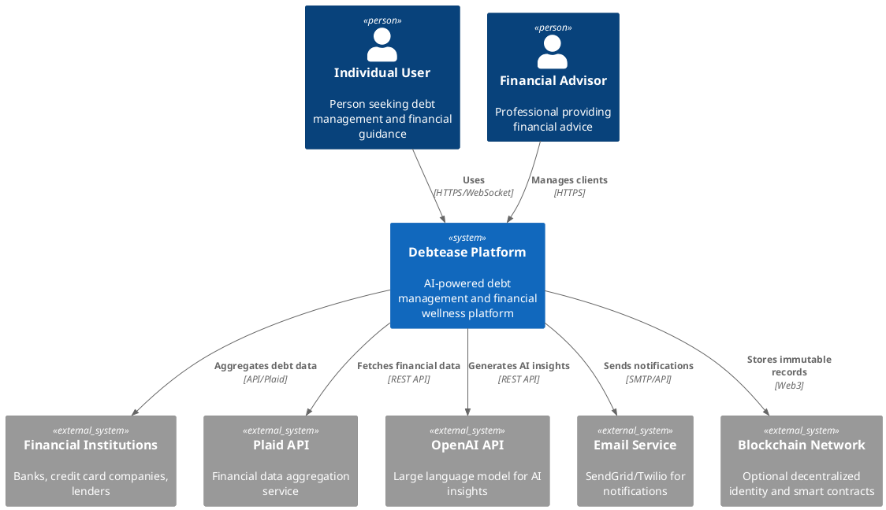

**Key External Dependencies:**
- **Financial Institutions**: Primary source of debt and transaction data
- **Plaid**: Secure financial data aggregation (sandbox environment for development)
- **OpenAI**: Core AI intelligence for debt analysis and recommendations
- **Email/SMS Services**: User notifications and reminders
- **Blockchain**: Optional decentralized features for immutable records

### Container Diagram (C4)

The platform follows a modern microservices-inspired architecture with clear separation of concerns.

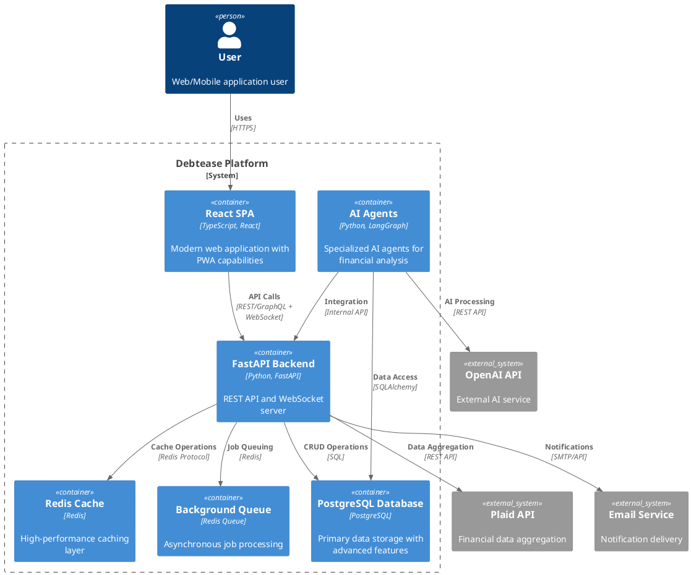

### Core Workflows

#### Primary User Journey
1. **User Onboarding** → 2. **Debt Portfolio Setup** → 3. **AI Analysis** → 4. **Strategy Selection** → 5. **Ongoing Management**

#### AI Processing Pipeline
**Data Ingestion** → **Analysis** → **Strategy Generation** → **Caching** → **Delivery**

#### Key Business Processes
- **Debt Analysis**: Multi-dimensional assessment of debt portfolio health
- **Strategy Optimization**: Comparative analysis of repayment approaches
- **Scenario Simulation**: "What-if" analysis for payment changes
- **Progress Tracking**: Real-time monitoring and milestone celebrations

### Technology Stack Rationale

#### Frontend Layer
- **React + TypeScript**: Type safety, component reusability, large ecosystem
- **Tailwind CSS + shadcn/ui**: Consistent design system, accessibility, performance
- **React Query**: Efficient data fetching and caching
- **React Router**: Client-side routing with protected routes

**Rationale**: Modern, scalable frontend stack optimized for complex financial dashboards and real-time updates.

#### Backend Layer
- **FastAPI + Python**: High performance, automatic API documentation, async support
- **Pydantic**: Data validation and serialization
- **SQLAlchemy**: ORM with async support and complex query capabilities

**Rationale**: Python ecosystem excels in AI/ML integration while FastAPI provides excellent API performance.

#### AI & Machine Learning
- **LangGraph**: Orchestration framework for complex multi-agent workflows
- **OpenAI GPT Models**: Advanced natural language processing for financial insights
- **Scikit-learn + XGBoost**: Traditional ML for pattern recognition and predictions

**Rationale**: LangGraph enables sophisticated agent coordination, essential for multi-step financial reasoning.

#### Data Layer
- **PostgreSQL**: ACID compliance, advanced JSON support, full-text search
- **Redis**: High-performance caching and session management
- **SQLAlchemy**: Async ORM with migration support

**Rationale**: PostgreSQL handles complex financial calculations and relationships, Redis enables real-time features.

#### Infrastructure & DevOps
- **Docker**: Containerization for consistent deployments
- **Vercel (Frontend)**: Global CDN, automatic scaling
- **Render (Backend)**: Managed hosting with auto-scaling
- **Supabase**: Managed PostgreSQL with real-time subscriptions

**Rationale**: Serverless-first approach reduces operational overhead while maintaining scalability.

### System Boundaries

#### In Scope (Core Platform)
- Debt portfolio management and analysis
- AI-powered repayment strategy optimization
- Financial insights and recommendations
- User progress tracking and gamification
- Basic budgeting and expense tracking
- Notification and reminder systems

#### External Integrations (APIs)
- Financial data aggregation (Plaid)
- AI language models (OpenAI)
- Email/SMS notifications (SendGrid/Twilio)
- Payment processing (future integration)
- Credit reporting (future integration)

#### Out of Scope (Third-Party Services)
- Direct bank connections (handled via Plaid)
- Investment management (separate wealth management features)
- Tax preparation and filing
- Insurance management
- Real estate transactions

#### Security Boundaries
- User data isolation and encryption
- API rate limiting and authentication
- Secure credential management
- Compliance with financial data regulations
- Regular security audits and penetration testing

---

## 3. Project Workings

### Data Flow Diagrams

#### User Onboarding and Authentication Flow

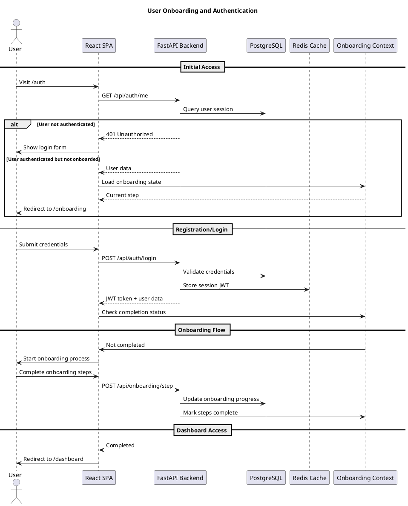

#### Debt Data Management Flow

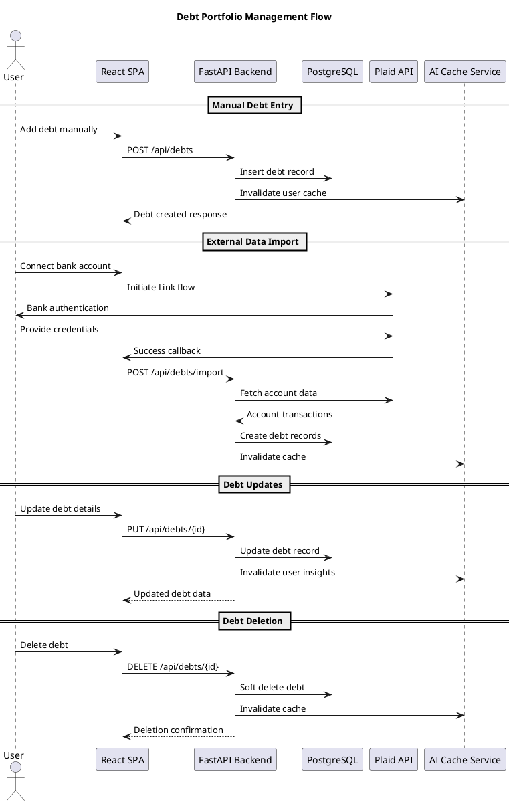

#### AI Insights Generation Flow

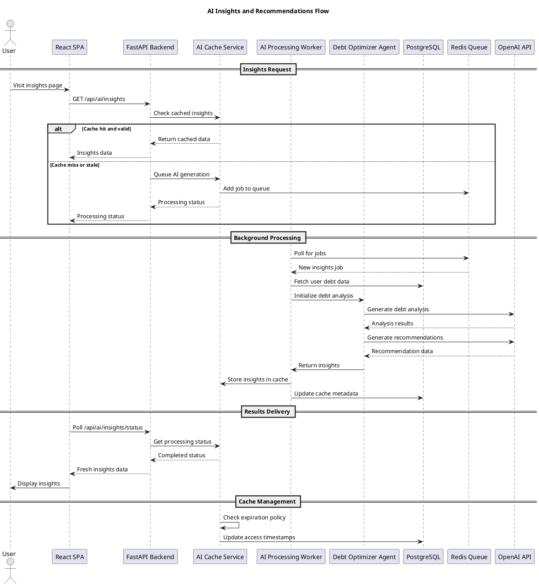

### User Journey Mapping

#### Primary User Journey: From Debt to Freedom

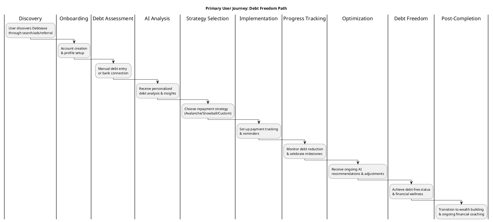

#### Detailed Onboarding Journey

**Phase 1: Account Setup (5-10 minutes)**
1. **Welcome & Goal Setting**: User defines financial goals and timeline preferences
2. **Profile Information**: Basic demographic and financial background data
3. **Privacy & Security**: Consent management and security preferences

**Phase 2: Debt Portfolio (10-20 minutes)**
1. **Debt Discovery**: Guided questions to identify all debts
2. **Manual Entry**: Step-by-step debt information collection
3. **Bank Integration**: Optional Plaid connection for automatic data import
4. **Debt Validation**: AI-assisted verification of entered data

**Phase 3: Financial Assessment (5-10 minutes)**
1. **Income Analysis**: Current income sources and stability assessment
2. **Expense Tracking**: Spending pattern identification and categorization
3. **Risk Assessment**: Financial vulnerability and emergency fund evaluation

**Phase 4: Strategy Introduction (5 minutes)**
1. **AI Analysis**: Initial debt portfolio analysis and recommendations
2. **Strategy Options**: Explanation of different repayment approaches
3. **Personalization**: AI-customized strategy suggestions

#### Ongoing Usage Journey

**Daily/Weekly Interactions:**
- Progress dashboard reviews
- Payment reminders and confirmations
- Achievement notifications and celebrations

**Monthly Reviews:**
- AI insights updates and new recommendations
- Strategy optimization suggestions
- Financial health score updates

**Quarterly Planning:**
- Major strategy adjustments
- Goal progress assessments
- Emergency fund and savings plan reviews

### AI Processing Pipeline

#### Multi-Agent AI Architecture

Debtease employs a sophisticated multi-agent system orchestrated through LangGraph, enabling complex financial reasoning and coordinated decision-making.

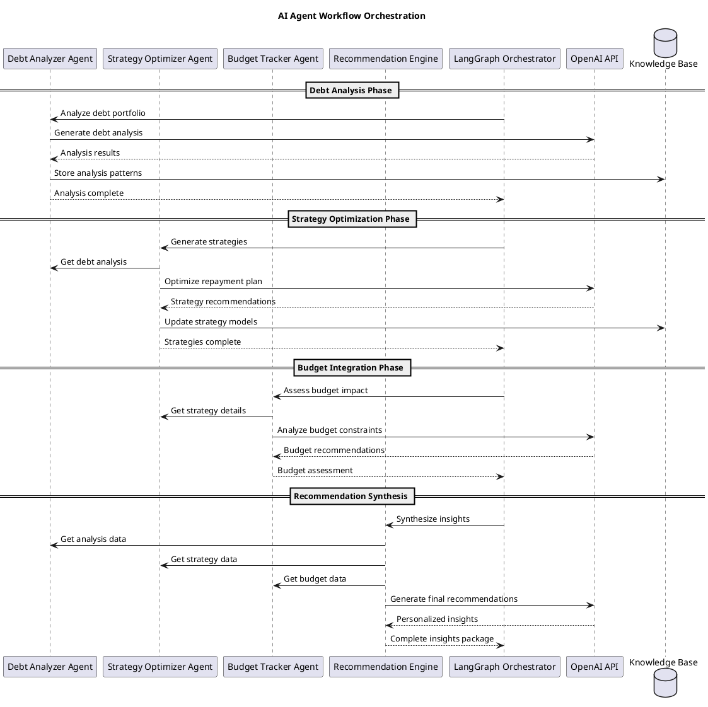

#### AI Processing Stages

**Stage 1: Data Preparation (Preprocessing)**
- Debt portfolio normalization and validation
- Historical payment pattern analysis
- Financial health metric calculation
- Risk factor assessment

**Stage 2: Multi-Dimensional Analysis**
- Interest rate optimization analysis
- Psychological debt repayment factors
- Cash flow and budget constraint evaluation
- Long-term financial goal alignment

**Stage 3: Strategy Generation**
- Avalanche vs. Snowball strategy comparison
- Custom hybrid strategy development
- Scenario-based "what-if" analysis
- Risk-adjusted recommendation weighting

**Stage 4: Recommendation Personalization**
- User behavior pattern incorporation
- Contextual factor consideration (life events, market conditions)
- Communication style adaptation
- Actionable next-step prioritization

#### Intelligent Caching Strategy

**Cache Architecture:**
- **Multi-Level Caching**: Redis (hot data) + PostgreSQL (persistent cache)
- **Smart Invalidation**: Event-driven cache updates on debt/portfolio changes
- **TTL Management**: Time-based expiration with usage-based extension
- **Compression**: Efficient storage of complex AI-generated content

**Cache Invalidation Rules:**
- **Debt Changes**: Immediate invalidation of user-specific insights
- **Payment Updates**: Partial cache updates for progress metrics
- **Time-Based**: Automatic refresh for time-sensitive recommendations
- **Usage-Based**: Popular insights retained longer in cache

**Performance Optimization:**
- **Background Processing**: Async AI generation with queue management
- **Progressive Loading**: Cached data served immediately, fresh data streamed
- **Cost Management**: Intelligent cache utilization reduces API calls
- **Scalability**: Distributed cache supporting horizontal scaling

---

## 4. Data Models

### Entity Relationship Diagram (ERD)

Debtease's data model centers around Users managing their Debt portfolios through Payments, with AI-driven insights cached for performance. The system supports complex financial relationships while maintaining data integrity and audit trails.

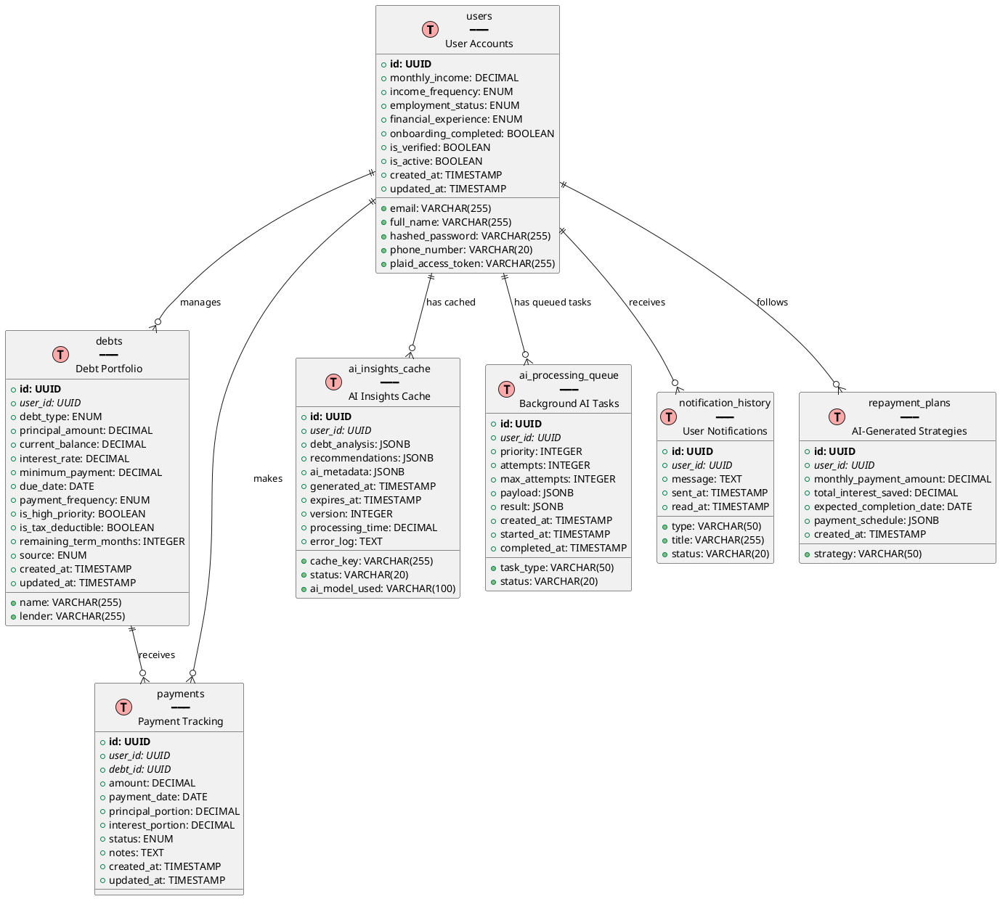

### Core Business Objects

#### User Entity
**Purpose**: Central identity and profile management for platform users
**Key Attributes**:
- **Authentication**: Email, hashed password, verification status
- **Financial Profile**: Monthly income, employment status, financial experience level
- **Onboarding State**: Completion tracking and progress management
- **Preferences**: Notification settings, income frequency
- **Integrations**: Plaid access tokens for bank connectivity

#### Debt Entity
**Purpose**: Comprehensive debt portfolio tracking with financial details
**Key Attributes**:
- **Financial Details**: Principal, balance, interest rate, minimum payments
- **Classification**: Debt type, priority level, tax deductibility
- **Scheduling**: Due dates, payment frequency, remaining term
- **Metadata**: Lender information, source (manual vs. imported), notes

#### Payment Entity
**Purpose**: Detailed payment tracking with principal/interest breakdown
**Key Attributes**:
- **Transaction Data**: Amount, date, status, notes
- **Allocation**: Principal vs. interest portion breakdown
- **Audit Trail**: Creation and update timestamps
- **Relationships**: Links to specific debts and users

#### AI Insights Cache Entity
**Purpose**: Performance optimization through intelligent caching of expensive AI computations
**Key Attributes**:
- **Cached Content**: Debt analysis, recommendations, metadata
- **Cache Management**: Key generation, expiration, version control
- **Performance Metrics**: Processing time, model used, error logging
- **Invalidation Logic**: Hash-based cache key for automatic updates

### Data Flow Between Components

#### User Registration → Onboarding → Dashboard Access

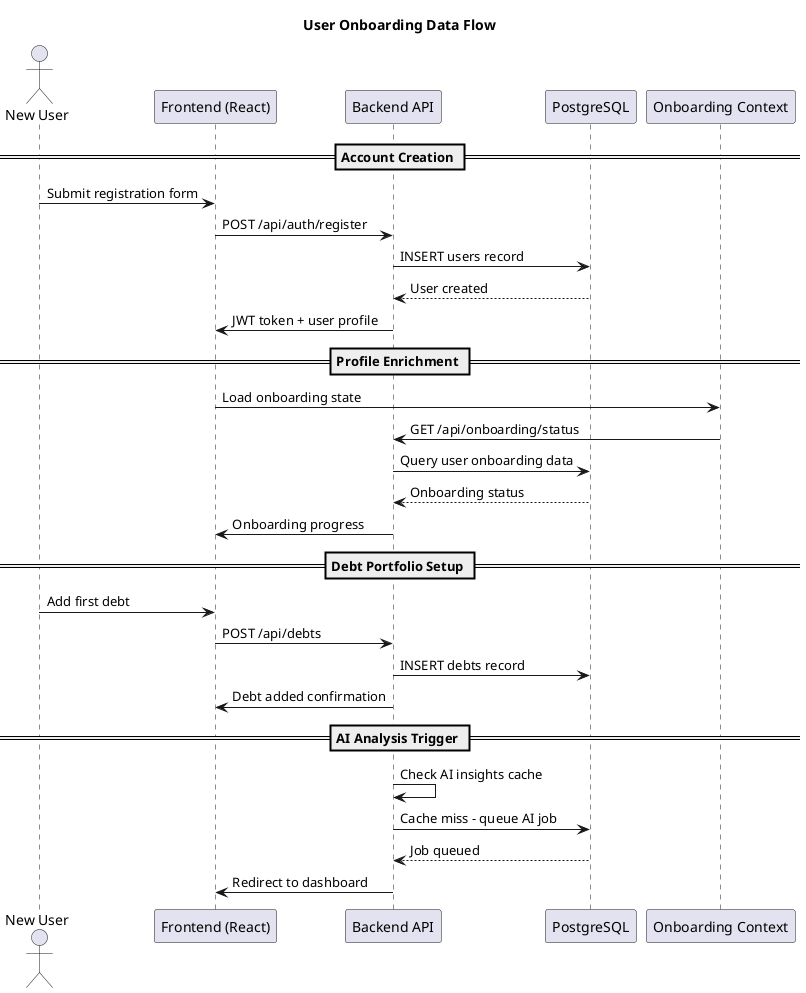

#### Payment Processing → Debt Updates → AI Insights Refresh

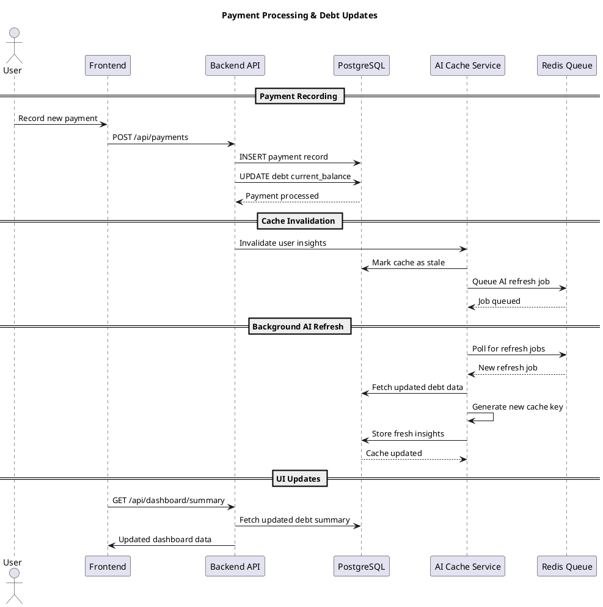

### Caching Data Structures

#### Multi-Level Cache Architecture

**Level 1: Redis (Hot Cache)**
- **Purpose**: Ultra-fast access for frequently requested data
- **TTL**: 15-60 minutes for volatile data
- **Content**: User sessions, API responses, temporary computations
- **Invalidation**: Event-driven (user actions, time-based)

**Level 2: PostgreSQL (Persistent Cache)**
- **Purpose**: Long-term storage of expensive computations
- **TTL**: 7 days for AI insights, 30 days for static data
- **Content**: AI-generated insights, complex analytics, user preferences
- **Invalidation**: Hash-based (debt portfolio changes) + time-based

#### Cache Key Generation Strategy

```python
def generate_cache_key(user_id: UUID, debt_portfolio: List[Dict]) -> str:
    """
    Creates deterministic hash from user's debt portfolio.
    Any change to debt data invalidates the cache automatically.
    """
    # Sort debts for consistent ordering
    sorted_debts = sorted(debt_portfolio, key=lambda d: d['id'])

    # Extract relevant fields for cache key
    signature = {
        'user_id': str(user_id),
        'debts': [{
            'id': str(debt['id']),
            'balance': debt['current_balance'],
            'interest_rate': debt['interest_rate'],
            'minimum_payment': debt['minimum_payment']
        } for debt in sorted_debts]
    }

    # Generate SHA256 hash
    return hashlib.sha256(
        json.dumps(signature, sort_keys=True).encode()
    ).hexdigest()
```

#### Cache Performance Metrics

- **Hit Rate Target**: >85% for AI insights
- **Average Response Time**: <100ms for cached data
- **Cache Size Management**: Automatic cleanup of expired entries
- **Background Refresh**: Proactive cache warming for active users

---

## 5. Key Implementation Details

### AI Agent Architecture

Debtease implements a sophisticated multi-agent AI system orchestrated through LangGraph, enabling complex financial reasoning and coordinated decision-making across specialized agents.

#### LangGraph Orchestration Framework

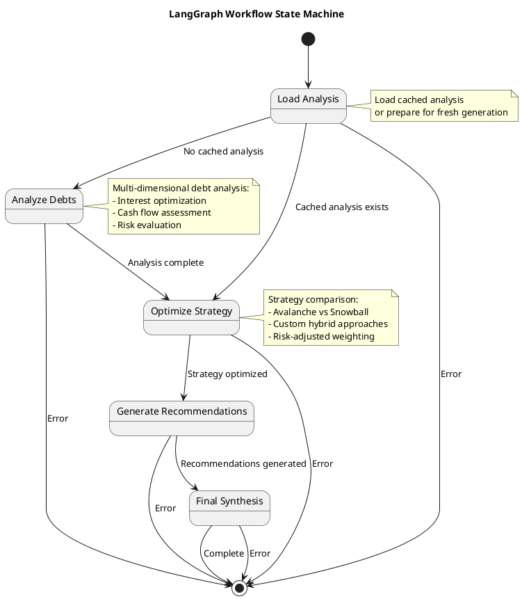

#### Specialized AI Agent Components

**1. Debt Analyzer Agent (`DebtAnalyzingAgent`)**
```python
class DebtAnalyzingAgent:
    """
    Specialized agent for comprehensive debt portfolio analysis.
    Uses pattern recognition and financial modeling.
    """

    def analyze(self, debts: List[Debt]) -> DebtAnalysis:
        """
        Perform multi-dimensional debt analysis:
        1. Portfolio composition and risk assessment
        2. Interest rate optimization opportunities
        3. Payment behavior patterns
        4. Debt consolidation potential
        5. Long-term financial impact projections
        """
        # Implementation uses OpenAI for complex reasoning
        # Structured prompts for consistent analysis output
        # Validation of financial calculations
        pass
```

**2. Strategy Optimizer Agent (`DebtOptimizerAgent`)**
```python
class DebtOptimizerAgent:
    """
    Mathematical optimization agent for repayment strategies.
    Employs algorithms for strategy comparison and customization.
    """

    def optimize(self, debts: List[Debt], analysis: DebtAnalysis) -> RepaymentPlanSummary:
        """
        Generate optimized repayment strategies:
        1. Mathematical comparison of Avalanche vs Snowball
        2. Custom hybrid strategy development
        3. Scenario-based "what-if" analysis
        4. Risk-adjusted recommendation weighting
        5. Long-term savings calculations
        """
        # Implementation uses financial mathematics
        # Monte Carlo simulations for uncertainty
        # Goal-oriented optimization algorithms
        pass
```

### Sequence Diagrams

#### AI Insights Generation Sequence

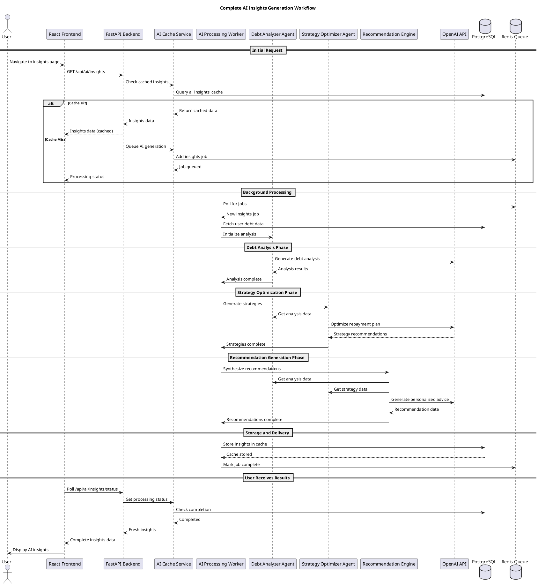

#### Authentication and Authorization Flow

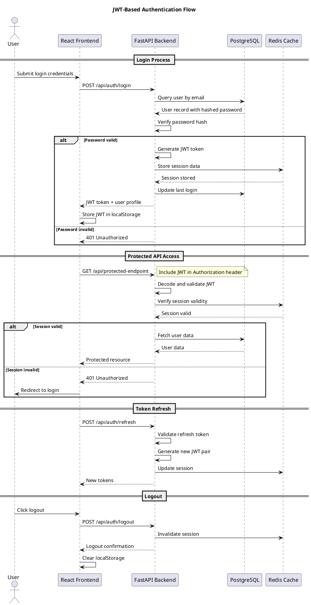

---

## 6. Appendices

### Glossary

#### Technical Terms
- **AI Agent**: Specialized software component that performs specific financial analysis tasks using AI/ML models
- **Avalanche Strategy**: Debt repayment method prioritizing highest interest rate debts first
- **Cache Key**: Unique identifier used to store and retrieve cached data
- **Debt-to-Income (DTI) Ratio**: Percentage of monthly income used for debt payments
- **JWT (JSON Web Token)**: Secure token format for authentication and authorization
- **LangGraph**: Framework for building complex AI workflows with state management
- **Snowball Strategy**: Debt repayment method prioritizing smallest balance debts first
- **TTL (Time To Live)**: Duration for which cached data remains valid

#### Business Terms
- **Debt Portfolio**: Complete collection of an individual's debts and financial obligations
- **Interest Optimization**: Strategy to minimize total interest paid over debt repayment period
- **Payment Allocation**: Division of payments between principal and interest portions
- **Repayment Horizon**: Estimated time required to become debt-free
- **Strategy Comparison**: Side-by-side analysis of different repayment approaches

### API Reference Summary

#### Core API Endpoints

**Authentication (`/api/auth`)**
- `POST /login` - User authentication
- `POST /register` - User registration
- `POST /refresh` - Token refresh
- `POST /logout` - User logout
- `GET /me` - Current user profile

**Debt Management (`/api/debts`)**
- `GET /` - List user debts
- `POST /` - Create new debt
- `PUT /{id}` - Update debt
- `DELETE /{id}` - Delete debt
- `POST /import` - Bulk import from Plaid

**Payment Tracking (`/api/payments`)**
- `GET /` - List payment history
- `POST /` - Record new payment
- `PUT /{id}` - Update payment
- `DELETE /{id}` - Delete payment

**AI Insights (`/api/ai`)**
- `GET /insights` - Get AI-generated insights
- `POST /insights` - Generate fresh insights
- `GET /strategies/compare` - Compare repayment strategies
- `GET /timeline` - Generate payment timeline
- `POST /optimize` - Calculate optimization metrics
- `POST /simulate` - Run payment scenario simulations

**Onboarding (`/api/onboarding`)**
- `GET /status` - Get onboarding progress
- `POST /step` - Complete onboarding step
- `PUT /profile` - Update user profile

#### Response Status Codes
- `200` - Success
- `201` - Created
- `400` - Bad Request (validation error)
- `401` - Unauthorized
- `403` - Forbidden
- `404` - Not Found
- `422` - Unprocessable Entity
- `500` - Internal Server Error
- `503` - Service Unavailable (AI processing)

### Deployment Architecture

#### Production Infrastructure

```plantuml
@startuml Production Deployment
!include <aws/common>
!include <aws/Storage/AmazonS3/AmazonS3>
!include <aws/Compute/EC2>
!include <aws/Database/RDS>
!include <aws/Network/ELB>

Vercel(Vercel, "Frontend Hosting", "Global CDN")
Render(Render, "Backend Hosting", "Managed FastAPI")
Supabase(Supabase, "Database Hosting", "PostgreSQL + Auth")

ELB(LoadBalancer, "API Gateway", "Request Routing")
EC2(Worker, "AI Workers", "Background Processing")

Vercel --> LoadBalancer : API Calls
LoadBalancer --> Render : Route to Backend
Render --> Supabase : Database Queries
Render --> EC2 : Queue Jobs
EC2 --> Supabase : Cache Storage
EC2 --> OpenAI : AI Processing

note right of Vercel
  Global CDN deployment
  Automatic scaling
  Edge caching
end note

note right of Render
  Auto-scaling containers
  Managed PostgreSQL
  Built-in monitoring
end note
@enduml
```

#### Environment Configuration

**Development Environment:**
- Local PostgreSQL database
- Redis for caching and queues
- Direct OpenAI API access
- File-based logging

**Staging Environment:**
- Render PostgreSQL (smaller instance)
- Redis Cloud (shared)
- OpenAI API with rate limits
- Structured logging to external service

**Production Environment:**
- Supabase PostgreSQL (production tier)
- Redis Cloud (dedicated)
- OpenAI API with enterprise limits
- Comprehensive monitoring and alerting

#### Scaling Strategy

**Horizontal Scaling:**
- **Frontend**: Vercel's global CDN handles traffic spikes
- **Backend**: Render auto-scaling based on CPU/memory usage
- **AI Workers**: Configurable worker pool size
- **Database**: Supabase connection pooling

**Performance Optimization:**
- **Caching**: Multi-level caching reduces database load
- **CDN**: Static assets served globally
- **Compression**: API responses compressed
- **Background Processing**: Expensive operations moved off critical path

### Performance Considerations

#### Key Metrics and Targets

**Response Times:**
- API endpoints: <500ms P95
- AI insights (cached): <100ms
- AI insights (fresh): <30 seconds
- Page load: <2 seconds

**Throughput:**
- API requests: 1000 RPS sustained
- AI processing: 50 concurrent jobs
- Database connections: 100 max

**Resource Utilization:**
- CPU usage: <70% average
- Memory usage: <80% average
- Database connections: <80% of limit
- Cache hit rate: >85%

#### Monitoring and Alerting

**Application Metrics:**
- Request latency and error rates
- AI processing queue depth
- Cache hit/miss ratios
- Database query performance

**Business Metrics:**
- User onboarding completion rate
- AI insights generation success rate
- Debt portfolio growth
- User engagement and retention

**Infrastructure Metrics:**
- Server resource utilization
- Database performance
- External API availability
- Background job processing

#### Bottleneck Mitigation

**AI Processing Bottlenecks:**
- Background queue processing
- Intelligent caching strategies
- Rate limiting for external APIs
- Fallback mechanisms for AI failures

**Database Bottlenecks:**
- Connection pooling
- Query optimization and indexing
- Read replicas for analytics
- Caching layer for frequent queries

**Frontend Bottlenecks:**
- CDN for static assets
- Code splitting and lazy loading
- Service worker caching
- Progressive loading of heavy components

---

**Document Version:** 0.1  
**Last Updated:** December 2025  
**Authors:** Debtease Development Team  
**Review Status:** Draft Complete - Ready for Review
